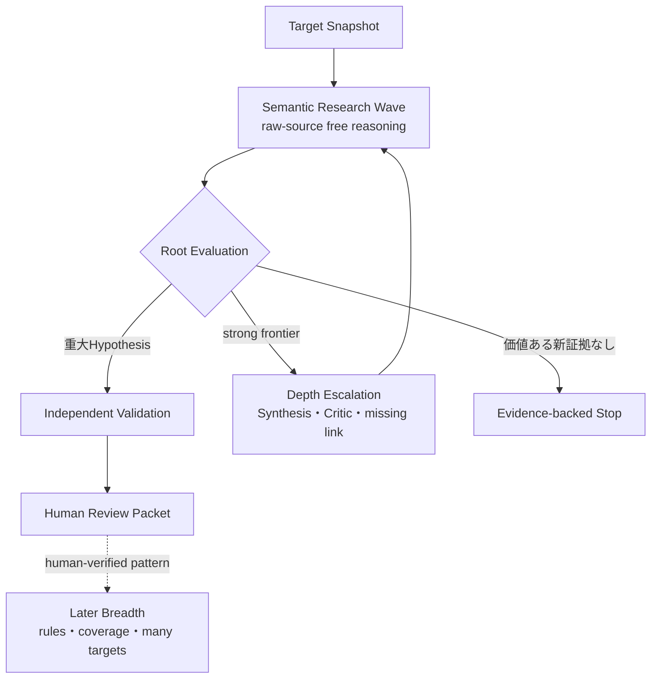

# 調査設計原則（Research Design Principles）

Status: accepted, 2026-09-05

この文書は、脆弱性探索に関する設計判断を読む最初の正本である。最上位にはWordfence Argus記事から採った10動詞を置き、公開実装へ落とす運用原則にはAnthropicのDefending Code Reference Harnessを使う。個別のinterfaceと例外はaccepted ADRが決める。

## 0. 何を最適化するか

第一目的は、既知脆弱性のoracleなしに**高impactなbroken security semanticsを取りこぼさず発見し、独立したsource-only Validationで明らかなfalse positiveを抑え、人間がfreshに実証できるReview Packetへ閉じること**である。RCEやsite-wide compromiseは最上位impactだが唯一の成功条件ではない。Unauthenticated SQL injection、意味的に深いStored XSS、account takeover、privilege escalation、arbitrary file operation、object injection、authorizationまたはbusiness-logic failure等、単独でも重大なcandidateを成果として扱う。

> **Do not optimize for sinks. Optimize for broken security semantics.**

sink、CWE、Surface Map nodeの網羅率は補助信号であり、Discoveryの目的関数ではない。trust boundary、state transition、persistent state、producer/consumer mismatch、decode/reparse、authorization assumption、cross-request、cross-actor、機能間compositionをsource semanticsから推論できることを重視する。

通常運転はraw-source-firstの有限Semantic Research Waveである。全Targetを最初からmulti-wave Depth Campaignへ入れない。十分に重大なHypothesisはRoot Evaluation後のValidationへ送り、強い未解決primitiveまたはhigh-impact frontierが残る時だけDepth Admissionを通してSynthesis、Critic、missing-link Waveへ追加投資する。最終impactが既にRCE/ATO/PrivEscと分かっていることをDepth Admissionの条件にしない。

現段階の評価優先順位は`high-impact recall -> root-cause quality -> attacker-premise closure -> independent validation -> false-positive behavior -> token/cost`とする。Budgetはhard ceilingとしてmodel外で強制するが、recallを落としてまでtokenやwall timeを削らない。cost最適化はbaseline確立後のablationで行う。詳細は[ADR 0117](../adr/0117-optimize-for-high-impact-semantic-recall.md)と[ADR 0122](../adr/0122-separate-source-validation-from-human-verification.md)を参照する。

## 1. 最上位の10原則

| 原則 | このharnessでの意味 |
| --- | --- |
| Confine（隔離する） | Target、worker、credential、runtime、networkを必要最小限の信頼領域へ閉じる |
| Constrain（制約する） | scope、予算、tool、並列数、停止条件をmodelの外側で強制する |
| Focus（焦点を定める） | 高水準のsecurity goalまたは具体的なmissing linkを与え、file、CWE、手順を固定しない |
| Motivate（動機づける） | 単独で重大なFindingと、高impactへ伸びる未解決primitiveの両方を追えるようにする |
| Parallelize（並列化する） | 言い換えではない独立したidea familyを、相互に見せず同時に育てる |
| Hypothesize（仮説化する） | premise、route、impact、unknown、falsifierを反証可能なartifactにする |
| Verify（検証する） | Discoveryと状態を共有しないfresh Validatorがsourceを反証し、最後は人間がfreshな隔離環境で再現する |
| Record（記録する） | positive、negative、blocked、unknown、低優先だが意味のあるprimitiveをsource provenanceとともに追記する |
| Prioritize（優先する） | impact、到達可能性、semantic novelty、未解決frontier、検証費用から次の有限workを選ぶ |
| Iterate（高速反復する） | Depth Admission後はwaveごとの証拠を統合・批判し、具体的missing linkをfresh runへ返す |

10動詞は10段pipelineでも10個のmoduleでもない。全Campaignと各反復で観測するcontrol propertyである。詳細は[ADR 0001](../adr/0001-ten-verbs-as-control-properties.md)を参照する。

## 2. Anthropicベストプラクティスの採用方法

[Anthropic Defending Code Reference Harness: Best Practices](https://github.com/anthropics/defending-code-reference-harness/blob/main/docs/best-practices.md)を、次の運用原則として採用する。

| 公開ベストプラクティス | このharnessへの適用 |
| --- | --- |
| systemを把握して探索空間を分割する | Root Plannerがrepository inventoryと過去artifactから独立research thesisを割り当てる。ただしSurface Map routeやfile集合を探索境界にしない |
| modelへ必要なcontext toolを渡す | Snapshot-boundなGlob・Grep・Readを主経路にする。小さな一時scriptは制約内で許せるが、semantic verdictをscriptへ委譲しない |
| DiscoveryとValidationを分離する | Discoveryは高recall、Validationは候補をsourceから積極的に反証する。conversation、scratch、verdictを共有しない |
| validatorへ投資する | 共通rubric、複数のfresh Attempt、tool-free Synthesis、明示的proof gapでHuman Review前のfalse positiveを抑える |
| Finder→Critic→Judgeを分ける | DepthではFinder、Adversarial Critic、Validation Attemptを分け、同じAttemptの自己確認を独立性と呼ばない |
| 独立runのunionを取る | 多数決ではなくsource-bound candidateの和集合を保持する。少数routeを支持数で捨てない |
| 一度のfan-outより短い反復を優先する | strong frontierへDepth Admissionした後にWave→Synthesis→Critic→Missing-link Waveを回し、同じPromptの並列数だけを増やさない |
| partial chainの不足primitiveをfresh runへ渡す | Route Fragmentから具体的なmissing linkを作り、新しいFinderへ限定された問いとして渡す |
| findingをruleとregressionへ変える | 検証済みFindingのうち構文的に一般化できる部分だけをSemgrep/CodeQLへ変換する。ruleはcoverage floorであり、自由探索の代替ではない |
| 実Targetを早期に回す | 完璧なMapやbenchmark suiteを待たず、小さいvertical sliceを実戦投入し、失敗をtyped artifactとtestへ戻す |
| large repositoryでは再分割する | summary、source search、Dependency Wishlist等を使い、単にagent数を増やさない |
| setupとattackを分離しsupervisorを守る | Researchのsource-only ValidationとHuman Verification Environmentを分け、root control planeをuntrusted sourceから隔離する |

Anthropic文書の「map the system first」は、探索前に完全なSurface Mapを生成してFinderへ強制する意味には採らない。必要なのは対象をnavigateし独立した研究方向を持てることであり、Default Finderはraw sourceからTarget全体へ自由にpivotできる。[ADR 0113](../adr/0113-keep-finder-methods-free-behind-an-evidence-shell.md)がこの適応を固定する。

## 3. 通常研究、Depth、Breadthを混ぜない

通常のSemantic Research WaveとArgus-likeなDepth Escalationは同じraw-source reasoning基盤を使うが、後者だけがmulti-wave chain pursuitを必須にする。単発で十分に重大なSQLi、Stored XSS、PrivEsc等を「長いchainでない」という理由で未完成扱いしない。一方、弱いprimitiveでもhigh-impactへ伸びる具体的可能性があれば単独severityだけで捨てない。

BreadthはWordfence PRISMが示すbreadth-first運行への対応であり、sink scannerの同義語ではない。短いAuthZやbusiness-logic bugもbreadthで発見し得る。将来はSemgrep、CodeQL、Surface Map、安価なmodel等で多数Targetへscaleするが、現在のhigh-impact semantic recallを確立するより先にcritical pathへ置かない。二Modeの責任は[ADR 0114](../adr/0114-separate-breadth-and-depth-campaign-policies.md)、通常運転とDepth Admissionは[ADR 0117](../adr/0117-optimize-for-high-impact-semantic-recall.md)を参照する。

## 4. 衝突時の優先規則

1. 最初のSemantic Research Waveはraw-source firstとし、Surface Map、AST route、既知rule hitを必須入力にしない。
2. Finderへ`source-first`、`sink-first`、`state-chain`等を固定手順として強制しない。開始lensまたは観測labelに限る。
3. Surface Map、PHP Program Index、Semgrep、CodeQLはnavigation、evidence、coverage、pattern expansionへ使えるが、Map外pathを探索対象外にしない。
4. HarnessはTarget、隔離、provenance、budget、artifact、barrier、停止、fresh Validationを管理し、何を見るか、何が怪しいか、何をchainするかというresearch decisionはmodelへ残す。
5. 一つのReady-for-human candidateが出てもstrong frontierが残る場合は自動終了しない。低優先candidateもsemantic mechanismまたはRoute Fragmentとして意味があれば記録する。
6. Depth Admissionは既知の最終impactではなくhigh-impact potentialで決める。強いread/write/file/auth/state capability、cross-request/cross-actor flow、persistent state、decode/reparse、producer/consumer mismatch、concrete missing link等を根拠にできる。
7. 通常のResearch loopは人間介入なしで進める。Human OSはHuman Verification、Finding、外部提出判断と例外的なEvidence Requestを所有し、探索方法を操作しない。
8. Map-first bootstrapまたは固定Strategy記述は移行元の履歴であり、新規Campaignには使わない。Map-first v1は完了済みLedgerのread-only replay互換だけを残し、ADR 0113、0117以後の判断を優先する。

## 5. 設計変更の受入条件

探索関連の変更は、少なくとも次を説明できなければ採用しない。

- high-impact recallを改善するか、少なくとも既存baselineを落とさないことをどう確認するか。
- 10原則のどれを改善し、何を観測すれば確認できるか。
- 高recall Discovery、source-only Validation、Human Verificationのどこに属するか。
- raw-source routeまたはMap外candidateを削除、downgradeしないか。
- model/providerを差し替えてもartifactとsecurity boundaryが保たれるか。
- positiveだけでなくnegative、blocked、unknown、partial Fragmentを残せるか。
- cost削減を目的とする場合、同じoracle-separated cohortでrecallを落とさないablationになっているか。
- 実Targetで短く試し、失敗をtestまたは次の有限設計変更へ戻せるか。
