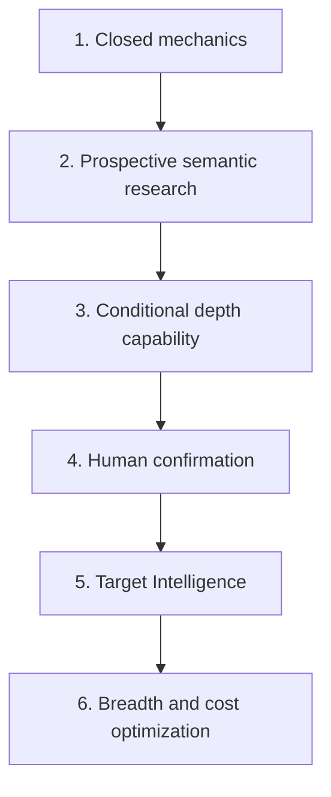
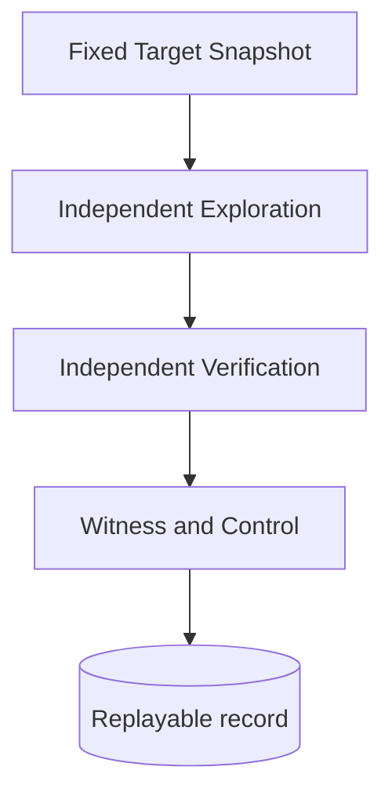
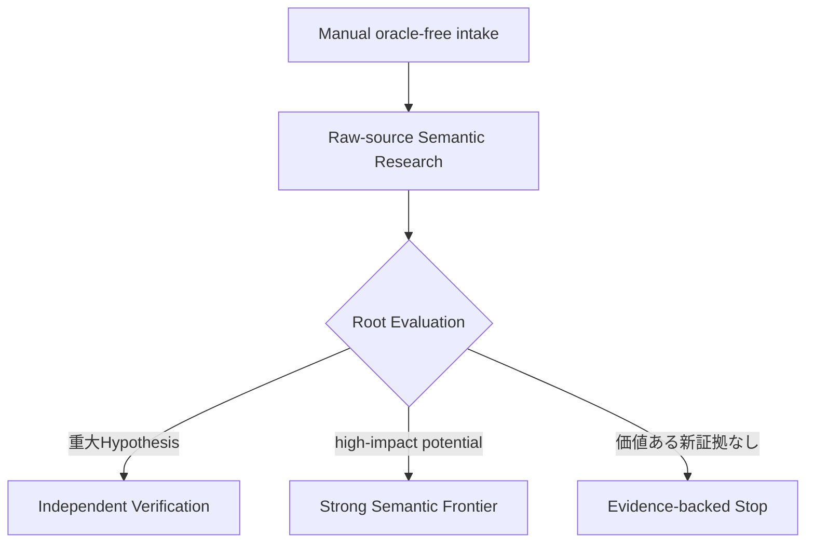
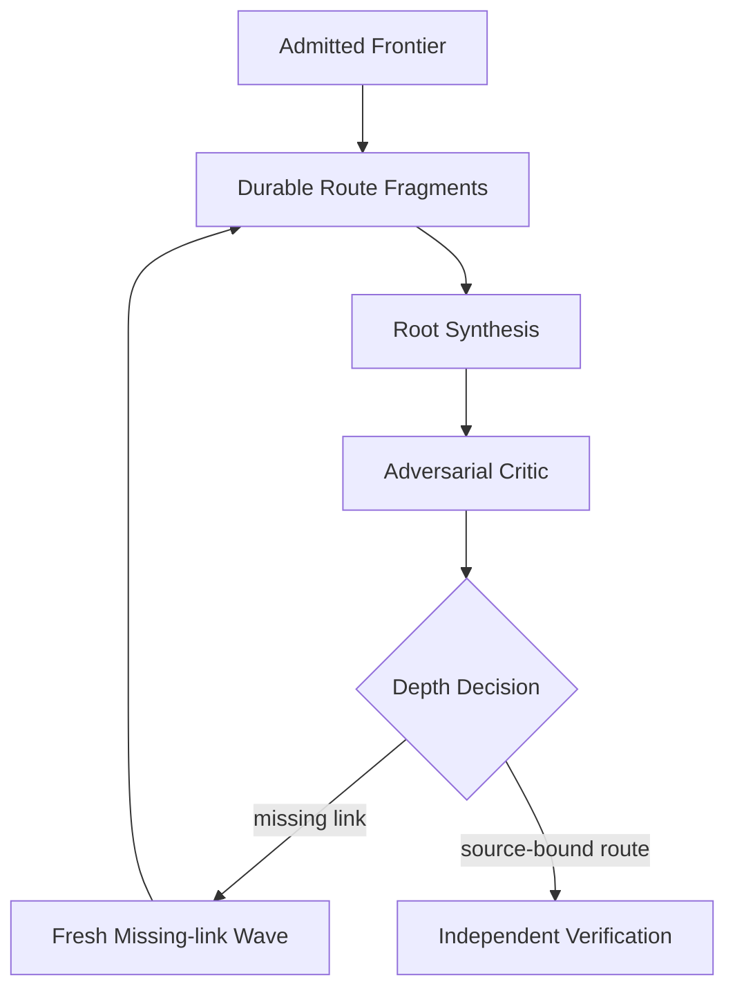
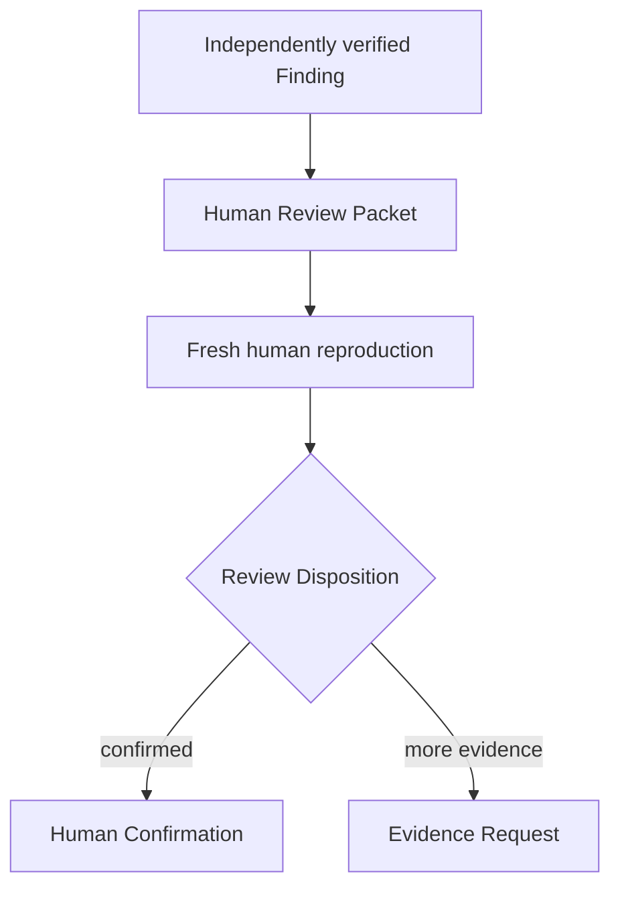
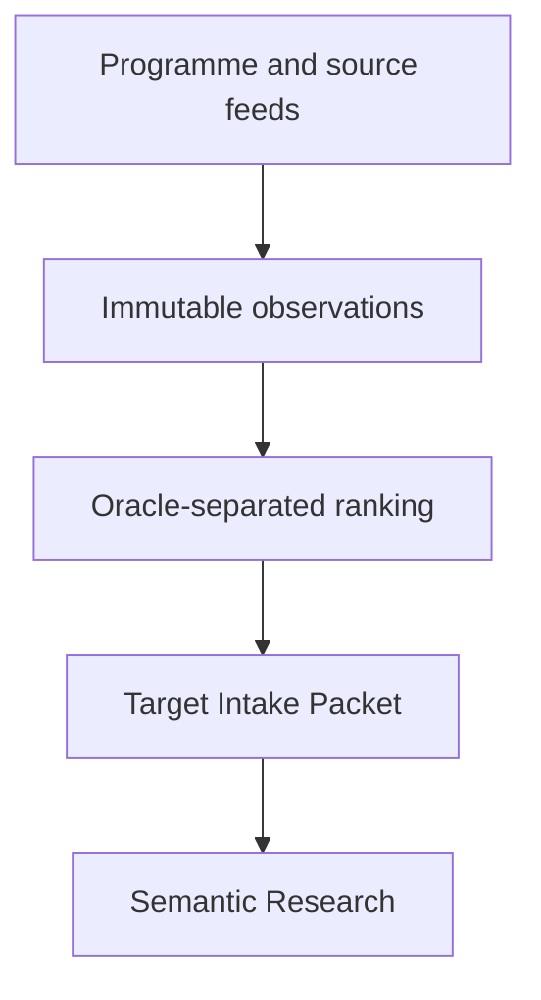
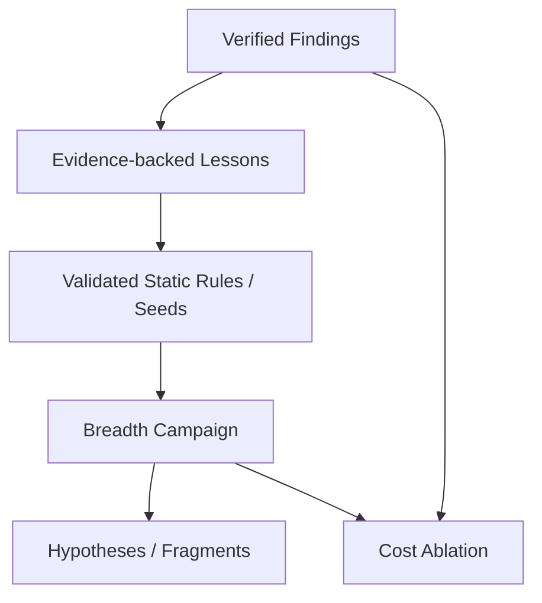
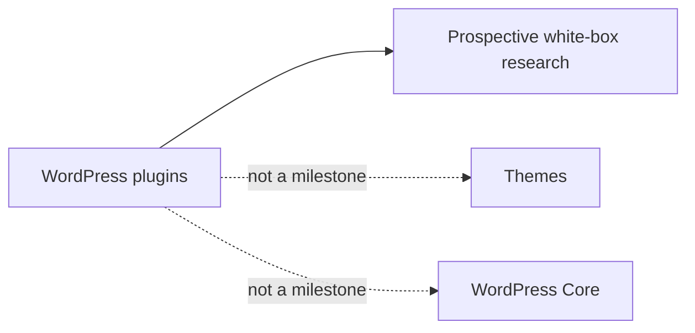

# Capability-first roadmap

Status: accepted capability order; current progress belongs in the [Codebase Guide](../CODEBASE-GUIDE.md)

ProductのNorth Starは、oracle-freeなprospective Campaignでhigh-impactなbroken security semanticsを発見し、独立Verificationで実証し、Human Review PacketからHuman Confirmationまで閉じる能力である。Researchは発見から独立Verificationまでを所有し、Human OSはその不変な証拠を人間が再確認する。RCEやsite-wide compromiseは最上位impactだが唯一の成功条件ではない。Unauthenticated SQL injection、意味的に深いStored XSS、account takeover、privilege escalation、arbitrary file operation、object injection等も独立した重大Findingとして扱い、high-impactへ伸びるRoute FragmentはDepth Escalationの入力にする。

現段階ではtoken costやtargets/hourよりhigh-impact recallを優先する。Budgetはhard ceilingとして維持し、cost最適化はrecall baseline確立後のablationで行う。詳細は[ADR 0117](../adr/0117-optimize-for-high-impact-semantic-recall.md)を参照する。

## Capability order

日付、進捗率、対象plugin、実装file、次のticketはこの文書へ書かない。現在地はCodebase Guide、実測は[experiments](../experiments/README.md)、次の作業はGitHub Issuesを正本とする。

## 1. Closed mechanics

一つのTargetで、研究の安全性と記録が端から端まで閉じる状態を作る。

合格条件は、有限Wave、独立Attempt、typed failure、isolated Lab、因果対照、artifact integrity、crash recovery、deterministic replayが一つのpublic pathで成立することである。公開済みBoundary Pairはresearch mechanicsの校正に使うが、未知発見能力の証明にはしない。

## 2. Prospective semantic research

手動投入した最新Targetへoracle-freeなSemantic Research Waveを早期に実戦投入し、high-impact Findingまたはstrong semantic frontierを得られるかで探索能力を改善する。

全Source Map完成、全provider対応、大規模benchmarkを開始条件にしない。raw-source探索を主経路とし、Surface Map、PHP Program Index、Semgrep、CodeQL等はnavigation、evidence、coverage、verified patternの横展開へ使う。Mapやstatic toolのnon-matchをsafeまたはclosureへ使わない。

最初の能力評価は、semantic depthの異なる小さなoracle-separated cohortとprospective Targetで行う。Simply Schedule Appointments SQLi、Brizy Stored XSS、TranslatePress Stored XSS、TranslatePress ATO等はdevelopment referenceとして使えるが、公開CVEの答えをprospective workerへ渡さない。`Researcher Reference`としてdarooの公開portfolioをmechanism breadthとevaluation gapの参照に使い、非公開methodまたはAI利用を推測しない。

Campaign中に人間がroute、priority、Hypothesisを操作しない。改善はversionを上げた次Campaignへ入れ、過去のrecordを変更しない。

初期production探索は一つの強いmodel familyを最大4つのfresh Finder Attemptに使い、異なるresearch thesisと独立contextで多様性を作る。Multi-modelは最初のproduct goalの必須条件にせず、single-model baselineが成立した後に`3 baseline + 1 challenger`等のCanary RevisionとしてProspective Campaignで評価する。single-modelがcohort floorを満たさない、またはprospectiveで根拠付きno-progressを繰り返す場合だけ前倒しで試す。

## 3. Conditional depth capability

Semantic Researchでstrong frontierが現れたTargetだけをmulti-wave Depthへ昇格し、partial primitiveを高impact routeへ接続する能力を閉じる。

Depth Admissionは既知のRCE/ATO/PrivEscを要求しない。強いread/write/file/auth/state capability、persistent state、cross-request/cross-actor flow、decode/reparse、producer/consumer mismatch、security assumption mismatch、具体的missing link等をhigh-impact potentialとして扱う。

SynthesisとCriticはsemantic判断をmodelへ残し、Harnessはartifact identity、source provenance、freshness、budget、状態遷移を強制する。Findingへの昇格はfresh Independent Verificationだけが行う。新しいExperiment mechanismは実戦Hypothesisが要求した順にvertical sliceで追加する。

## 4. Human confirmation

最新Targetを手動投入したProspective Campaignから得た未公開のhigh-impact Findingを、Discoveryのconversationや自己評価に依存せず人間が再確認できる状態へ閉じる。

PacketはTarget identity、Evidence Route、source引用、Witness、Causal Control、再現手順、既知の限界をdigest固定し、raw model transcriptやprovider sessionを含めない。Human Confirmationは同じoperatorが担当できるが、fresh LabとPacketから独立に再現する。公開済みCaseまたは既知duplicateのoracle-freeな再発見は能力証拠として残すが、最初のproduct goalの未知Findingには数えない。

最初のproduct goalは、一件以上のprospectiveな未知high-impact FindingがIndependent VerificationとHuman Confirmationの両方を通過した時に到達する。これは能力の存在を示すが、recallまたは安定性の推定ではない。External Action Authorization、submission、vendor communicationはこの到達条件と分離する。

## 5. Target Intelligence

手動経路を残したまま、上流に定期取得、eligibility、ranking、自動候補選定を追加する。

known-vulnerability情報は選定・重複排除の境界に隔離し、prospective workerへadvisory、CVE、patch narrative、known symbol、payloadを渡さない。API障害は固定済みCampaignへ影響させない。

Target rankingは将来の収益性、install数、過去Finding傾向等を利用できるが、Research内部の技術的真偽と混ぜない。まずresearch engineのrecallを成立させ、対象選定の自動化を先に最適化しない。

## 6. Breadth and cost optimization

high-impact recallのbaselineが安定した後、verified FindingとResearcher Referenceから得たmechanism coverageを多数Targetへscaleする。

BreadthはPRISM-likeなbreadth-first運行への対応であり、単純sink scannerの同義語ではない。Semgrep、CodeQL、Surface Map、cheap/medium models等を積極利用してtargets/hour、precision、coverage、costを改善できるが、rule matchはFindingではなく同じVerificationを通すHypothesisである。

cost最適化はFinder数、model、context量、Wave数、static prefilter等を一変数ずつ変更し、同じoracle-separated cohortでhigh-impact recallとroot-cause qualityを落とさない場合だけ採用する。単価を下げてもATO、RCE、PrivEsc、SQLi、strong Stored XSS等のrecallが落ちる構成は不採用とする。

## Scope boundary

Programme eligibilityはTarget選定時とHuman Confirmation後に技術的真偽から分離して確認できる。External Action Authorization、submission、vendor communication、patch generation、dashboardは最初のproduct goalの外側に置く。安全隔離とevidence integrityに必要な最小限を除き、探索能力より先に周辺運用を網羅しない。
