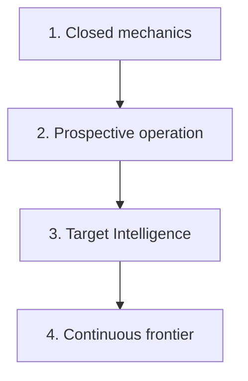
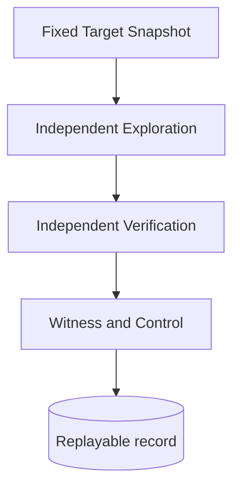
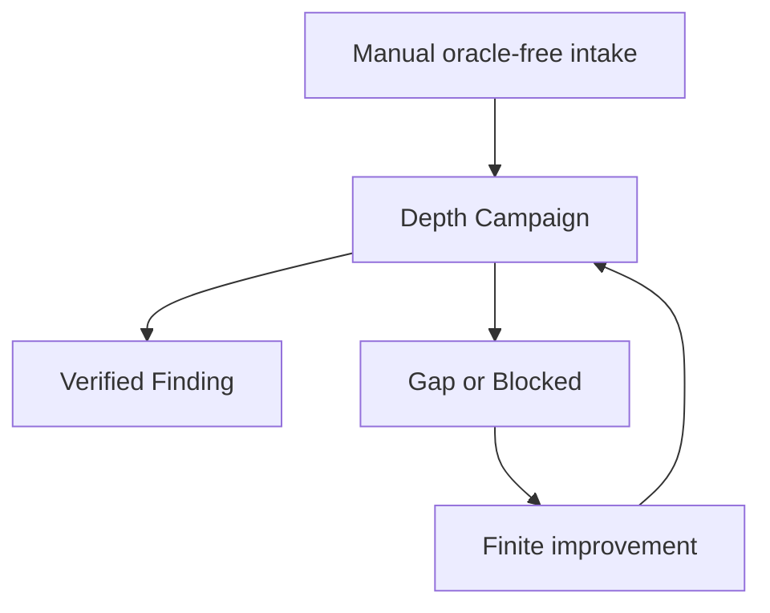
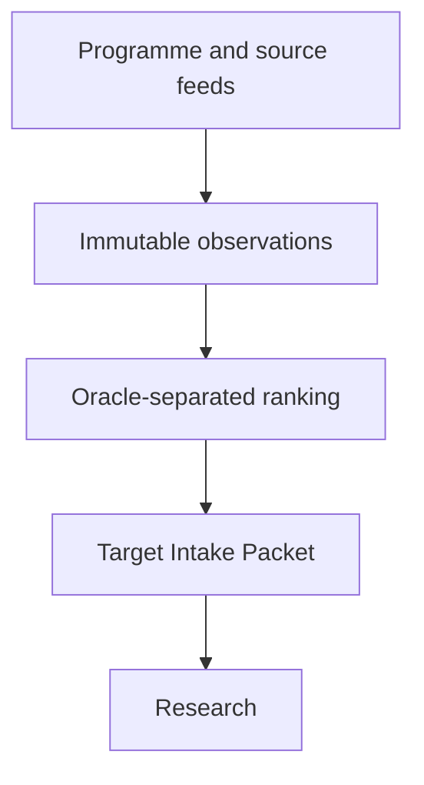
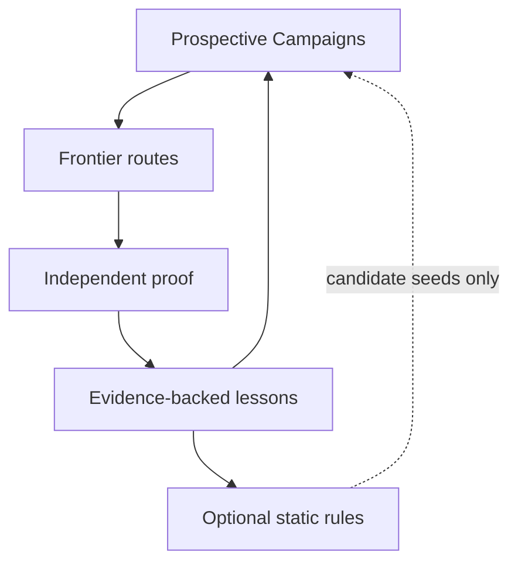
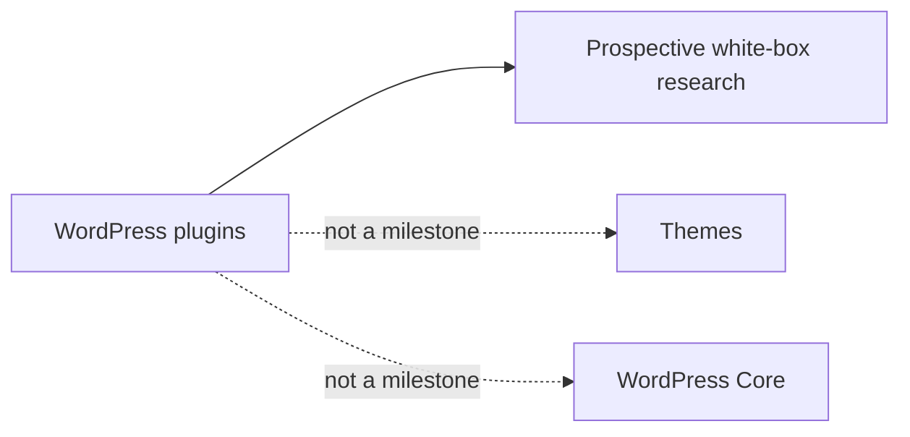

# Capability-first roadmap

Status: accepted capability order; current progress belongs in the [Codebase Guide](../CODEBASE-GUIDE.md)

North Starは、oracle-freeなprospective Campaignで未知のRCEまたは同等のsite-wide compromiseへ至るrouteを発見し、独立Verificationで実証することである。SQL injection、Stored XSS、account takeover等は独立Findingであると同時に、長いchainのprimitiveとして扱う。

## Capability order

日付、進捗率、対象plugin、実装file、次のticketはこの文書へ書かない。現在地はCodebase Guide、実測は[experiments](../experiments/README.md)、次の作業はGitHub Issuesを正本とする。

## 1. Closed mechanics

一つのTargetで、研究の安全性と記録が端から端まで閉じる状態を作る。

合格条件は、有限Wave、独立Attempt、typed failure、isolated Lab、因果対照、artifact integrity、crash recovery、deterministic replayが一つのpublic pathで成立することである。公開済みBoundary Pairはresearch mechanicsの校正に使うが、未知発見能力の証明にはしない。

## 2. Prospective operation

手動投入した現行Targetへoracle-free Campaignを早期に実戦投入し、結果から探索能力を改善する。

全Source Map完成、全provider対応、大規模benchmarkを開始条件にしない。raw-source探索を主経路とし、Surface Map、Semgrep、CodeQL等は補助・coverage・verified patternの横展開に使う。新しいExperiment mechanismは実戦Hypothesisが要求した順にvertical sliceで追加する。

Campaign中に人間がroute、priority、Hypothesisを操作しない。改善はversionを上げた次Campaignへ入れ、過去のrecordを変更しない。

## 3. Target Intelligence

手動経路を残したまま、上流に定期取得、eligibility、ranking、自動候補選定を追加する。

known-vulnerability情報は選定・重複排除の境界に隔離し、prospective workerへadvisory、CVE、patch narrative、known symbol、payloadを渡さない。API障害は固定済みCampaignへ影響させない。

## 4. Continuous frontier

複数のprospective Campaignと学習loopを、最重大impactへ継続的に向ける。

verified Findingから再利用可能なLessonやstatic rule candidateを作る。rule matchは新しいHypothesisとして同じVerificationを通し、agentic discoveryとstatic-assisted discoveryのprovenanceを分ける。

## Scope boundary

Programme eligibility、submission、vendor communication、patch generation、dashboardはNorth Star探索の外側に置く。安全隔離とevidence integrityに必要な最小限を除き、探索能力より先に周辺運用を網羅しない。
