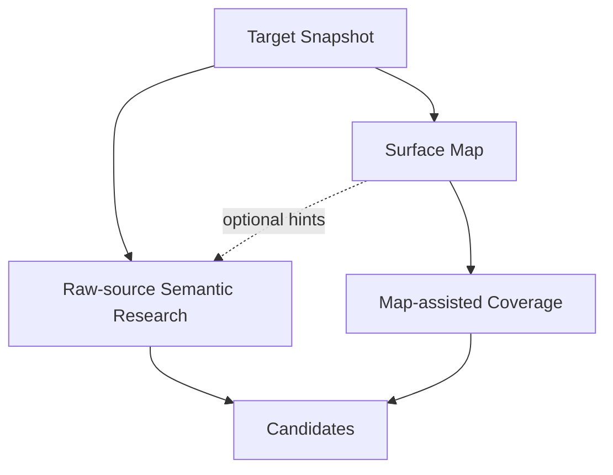

# Source mapping seam

Status: accepted design; Surface Map is optional exploration support

## Owner and purpose

`Source Mapping`は固定`Target Snapshot`から、根拠の強さと未解決部分を失わないversioned `Surface Map`を作る。これはnavigation、coverage、verified patternの横展開に使う補助地図であり、探索範囲または安全性の証明ではない。

```ts
interface SourceMapping {
  build(input: SurfaceMappingInput): Promise<SurfaceMapRef>;
}
```

parser、AI Mapper、runtime observation、revision mergeはこのInterfaceの背後へ隠す。

## Position in discovery



Map nodeがないpathもFinderは読める。Mapやstatic ruleのnon-matchをcandidate rejectionまたはclosureへ使わない。最初のSemantic Research Waveはraw sourceから独立に始められる。

## Evidence-graded construction

Deterministic skeletonはinventory、digest、構文fact、source anchor、stable identityを固定する。AI Mapperは追加claimだけを提案し、Source Mappingがpath、digest、range、premise、predecessor bindingを検査する。

Evidence stateは`observed / inferred / unknown`を区別する。AIは既存`observed`を削除またはdowngradeできず、矛盾は上書きせずConflictとして残す。

PHP、JavaScript、template、SQL、configuration、translation、bundled vendor、generated、minified、binary、unsupportedを黙って除外しない。解析しないassetもdigest、分類、reasonをgapへ残す。

## Runtime observation boundary

Runtime observationはdynamic registration等のmapping gapを決定するためだけにsealed baselineのfresh cloneとtyped planで行う。timeoutまたはLab failureはrelation不存在ではなく`unknown`になる。観測結果をVerificationのWitnessやCausal Controlへ再利用しない。

## Invariants

1. Surface MapはFinding、priority、worker allocation、探索範囲を決めない。
2. source本文とcredential literalをMap artifactへ複製しない。
3. model proposalはclaim単位で検査し、黙って修復しない。
4. arrival orderに依存せずstable identityを作る。
5. incomplete Mapでもraw-source Explorationを妨げない。
6. static toolのnon-matchをsafeまたはclosureへ使わない。

## Failure and Behavior Test

identity/digest/schema不一致はbuildを拒否する。parse diagnosticやunsupported assetはgap付きrevision、AI failureはdeterministic skeletonを保持した`mapping-incomplete`、observation failureはreason付き`unknown`にする。

Testは`build(input)`とimmutable viewを観測し、parser visitor、prompt数、model call countを固定しない。決定性、dynamic callbackのunknown保持、非PHP assetのgap、invalid AI claimの部分棄却、observed factの不変性、revision lineage、runtime evidenceのVerification流用拒否を保護する。

探索全体での位置づけは[Research Design Principles](research-design-principles.md)、現在のgeneratorと実装pathは[Codebase Guide](../CODEBASE-GUIDE.md)、対象別の実測は[Experiments](../experiments/README.md)を正本とする。
