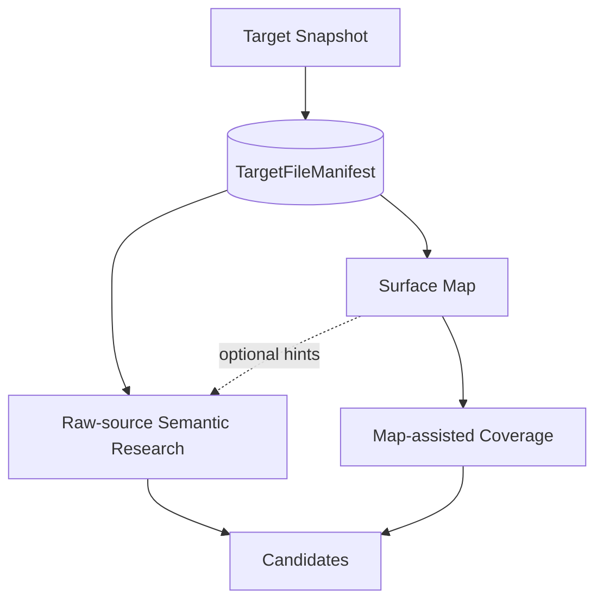

# Source mapping seam

Status: accepted design; Surface Map is optional exploration support

## Owner and purpose

Source UnderstandingはResearch内の`TargetFileManifest`をsource identityの正本として所有する。Target Intelligenceの`Canonical File Manifest`にあるpath、原文bytes digest、sizeを、Researchが`Target Snapshot`を確定した直後に損失なく一度だけ投影し、Target Snapshotへbindした不変artifactとしてCASへ置く。取得、正規化、受入policyは再実行しない。

`Source Mapping`はその固定`Target Snapshot`と`TargetFileManifest`から、根拠の強さと未解決部分を失わないversioned `Surface Map`を作る。これはnavigation、coverage、verified patternの横展開に使う補助地図であり、探索範囲、安全性、source identityの証明ではない。[ADR 0118](../adr/0118-bind-source-provenance-to-the-target-file-manifest.md)を正本とする。

```ts
interface SourceMapping {
  build(input: SurfaceMappingInput): Promise<SurfaceMapRef>;
}
```

parser、AI Mapper、source-evidence inspection、revision mergeはこのInterfaceの背後へ隠す。

## Position in discovery



Map nodeがないpathもFinderは読める。Mapやstatic ruleのnon-matchをcandidate rejectionまたはclosureへ使わない。最初のSemantic Research Waveはraw sourceから独立に始められる。

Source UnderstandingはTargetFileManifestへ拘束した論理的な`list / search / read`の意味、pathとfile digestの検査、responseのsource identityを所有する。TargetFileManifest全件をworker promptへ埋め込まず、必要なsourceだけをpullできるinterfaceを提供する。Model Executionはこの論理queryをprovider toolへbindするが、path、scope、result、failureをprovider別に解釈し直さない。

## Manifest-bound source query v2

worker-visibleなtoolは`source_list / source_search / source_read`の三つに限定する。Attempt、role-specific assignment、Target Snapshot、TargetFileManifest、Source Tool Policy、query ordinal、残budgetはtrusted control planeが注入し、model入力にしない。assignmentはRoot Plannerの`initial-research-planning`、通常Finderの`research-thesis`、missing-link Finderの`frontier-gap`、Adversarial Criticの`chain-critique`を同じversioned unionで拘束し、Depthだけがsource tool bindingから外れない。各入力は初回queryまたはopaque continuation cursorのどちらかであり、cursorと新しいselectorを同時に受理しない。

pathはTarget Snapshot rootからのcase-sensitiveなPOSIX相対pathである。先頭`/`、backslash、空segment、`.`、`..`は許可しない。file pathはManifest entryとの完全一致、directory pathは末尾`/`を持たない正規形とし、rootは空文字や`.`ではなく`{ kind: "root" }`で表す。directoryはManifestにdirectory entryを要求せず、`directory + "/"`をprefixに持つfileの存在から導出する。自由な文字列prefixによる部分一致は行わない。

三toolの初回queryは次の意味を持つ。

| Tool | 最小入力 | 意味 |
| --- | --- | --- |
| `source_list` | `scope: root | directory(path)`、`traversal: children | recursive` | derived directoryとManifest fileをstable orderで列挙する。fileはpath、digest、sizeを返す |
| `source_search` | 改行なしのexact UTF-8 literal、`scope: root | directory(path) | files(paths)` | literalを指定scopeで検索し、path / digest / line / byte offsetを持つ0個以上のanchorを返す |
| `source_read` | exact file path、Manifest file digest、`startLine / endLine` | 一つのManifest fileの指定rangeを読み、実際に返したbytesだけをsource anchorへ固定する |

`source_list`の`children`は直下のderived directoryとfile、`recursive`は配下の全fileを返す。whole-snapshot inventoryは`root + recursive`として明示できる。`source_search`は初期versionでregex、glob、symbol resolution、fuzzy matchを持たない。複数matchは正常なplural responseであり`ambiguous`ではない。将来singular resolverが必要になった時だけ、新しいschema versionで`ambiguous`を導入する。

全plural responseはpath、次にsource offsetのstable orderを使う。policyのpage / scan / response上限へ達した場合は`truncated`という行き止まりにせず、`partial`、上限理由、走査済みfiles / bytes / matches、`nextCursor`を返す。cursorはschema version、Target、Manifest、Policy、operation、元selector、次positionへbindしたopaque tokenであり、workerがoffsetを組み立てない。read cursorはUTF-8 code pointを分断せず、同じrequested rangeの未返却byteから再開する。tamper、別Manifest、別operation、selector併記はsourceを読まず`invalid-query`にする。

terminal resultは次を区別する。

| Result | 意味 |
| --- | --- |
| `completed` | 指定scopeを上限内で完了した。0件も正常になり得る |
| `partial` | scopeの未走査または未返却部分があり、理由とcontinuationを持つ |
| `not-found` | canonicalなfile / directoryがManifestにない、range外、またはscopeを完全走査してliteralがなかった |
| `invalid-query` | 非canonical path、schema不一致、cursor不一致等で意味を確定できない |
| `policy-denied` | path escape、operation不許可、Target / Policy binding不一致等を実行前に拒否した |
| `identity-mismatch` | canonical fileは存在するが要求digestまたは固定Snapshot上の実bytesがManifestと一致しない |
| `budget-exhausted` | Attempt全体のsource query hard ceilingに達し、continuationを実行できない |

`partial`なsearchでmatchが0件でも`not-found`へ丸めず、unobserved範囲を明示する。provider failure、bridge failure、timeoutはsource queryの意味結果へ変換せずModel Executionのterminal reasonとして残す。

全tool callは成功、schema不正、deny、not-foundを含めて一つのTool Receiptを持つ。ReceiptはAttempt、role-specific assignment、Target、Manifest、Policy、query ordinal、canonical requestまたは拒否されたinput digest、policy decision、走査量、result、response digest、continuation digestを固定する。Source Understandingはlogical query、Manifest検査、stable ordering、result、responseを所有し、Model Executionはprovider schema、trusted field注入、transport、Tool Receiptとの結合を所有する。source本文、Manifest全件、cursor tokenをLedgerへ複製せずprivate CASのresponseから参照する。

既存schema version 1の`prefix`、`truncated`、`path-outside-snapshot`へ丸めたnot-found / digest mismatchは既存Receiptのreplayに限り保存する。新規Campaignはv2だけを生成し、v1 eventまたはartifactを書き換えない。

## Source identity and Map claims

新規Campaign、Exploration、Validationは`TargetFileManifest` refを必須入力にし、source anchorのpathとfile digestをManifestに対して検査する。Surface Map refは任意であり、与えられた場合だけnavigationまたはcoverage hintとして使う。

classificationとcoverageはSurface Map固有のclaimであり、Manifestへ追加しない。既存`SurfaceMap.inventory`のpath、digest、sizeはv1互換のためManifestから作る派生copyとして残すが、ExplorationまたはValidationのprovenance判定には使わない。Map revisionは同じManifest digestへbindし、派生copyまたはclaimがManifestと一致しないMapを受理しない。

## Evidence-graded construction

Deterministic skeletonはinventory、digest、構文fact、source anchor、stable identityを固定する。AI Mapperは追加claimだけを提案し、Source Mappingがpath、digest、range、premise、predecessor bindingを検査する。

Evidence stateは`observed / inferred / unknown`を区別する。AIは既存`observed`を削除またはdowngradeできず、矛盾は上書きせずConflictとして残す。

PHP、JavaScript、template、SQL、configuration、translation、bundled vendor、generated、minified、binary、unsupportedを黙って除外しない。解析しないassetもdigest、分類、reasonをgapへ残す。

## Source-only boundary

Source MappingはTarget code、WordPress、build、testまたはpackage scriptを実行しない。dynamic registration等を固定sourceから決められない場合は`unknown`としてgapに残し、Human Verificationのruntime observationをSurface Mapの`observed` evidenceへ逆流させない。

## Invariants

1. Surface MapはFinding、priority、worker allocation、探索範囲を決めない。
2. source本文とcredential literalをMap artifactへ複製しない。
3. model proposalはclaim単位で検査し、黙って修復しない。
4. arrival orderに依存せずstable identityを作る。
5. incomplete Mapでもraw-source Explorationを妨げない。
6. static toolのnon-matchをsafeまたはclosureへ使わない。

## Failure and Behavior Test

identity/digest/schema不一致はbuildを拒否する。Manifest artifactが存在しない、またはTarget Snapshotへbindできない場合はMapやworkerを作る前にtyped failureとして停止し、Surface Map inventoryからManifestを合成しない。任意で指定されたMapがManifestと不一致なら黙ってMapなしへfallbackせず、そのPlanを拒否する。parse diagnosticやunsupported assetはgap付きrevision、AI failureはdeterministic skeletonを保持した`mapping-incomplete`、observation failureはreason付き`unknown`にする。

Testは`build(input)`、manifest-boundなsource query、immutable viewを観測し、parser visitor、prompt数、model call countを固定しない。決定性、dynamic callbackのunknown保持、非PHP assetのgap、invalid AI claimの部分棄却、observed factの不変性、revision lineage、target code非実行に加え、Mapなしで任意のManifest fileへ到達できることを保護する。

source queryのBehavior Testは、root / directoryとchildren / recursive、trailing slashなしのdirectory、stable paginationで重複または欠落がないこと、partial searchをnot-foundへ丸めないこと、read continuationを連結するとrequested bytesへ戻ること、canonicalな不存在、path escape、digest mismatchをそれぞれ別resultにすること、invalid cursorでsourceを読まないこと、同じlogical queryがprovider Adapterに依存しないことを観測する。公開可能な実Targetでもroot / directory Listが予期せずpolicy denyにならず、escapeだけが外部read前に拒否されることを確認する。query数とbyte数の具体的上限値はCampaign policyが所有する。

探索全体での位置づけは[Research Design](../RESEARCH-DESIGN.md)、現在のgeneratorと実装pathは[Codebase Guide](../CODEBASE-GUIDE.md)、対象別の公開実測は[Knowledge](../knowledge/)へ置く。
