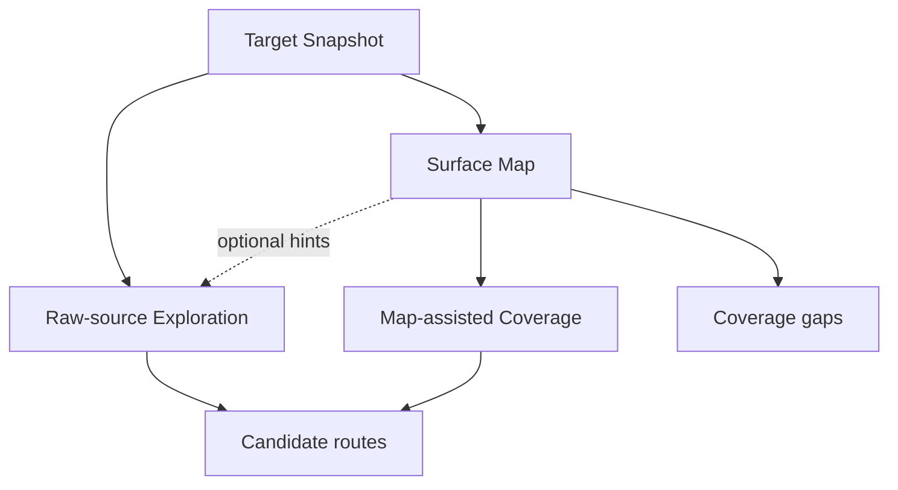
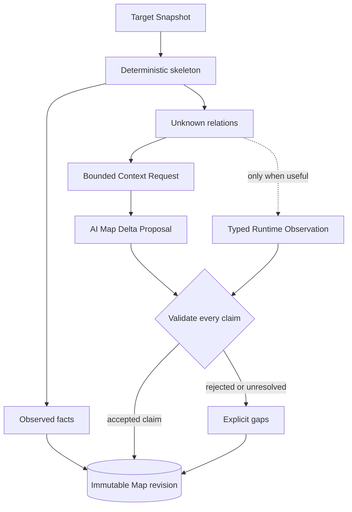
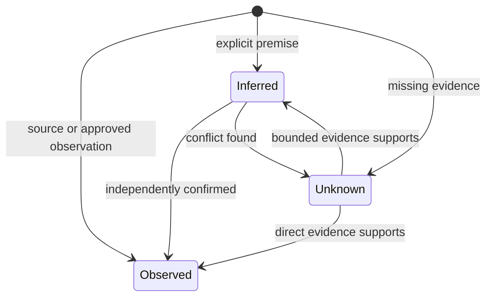
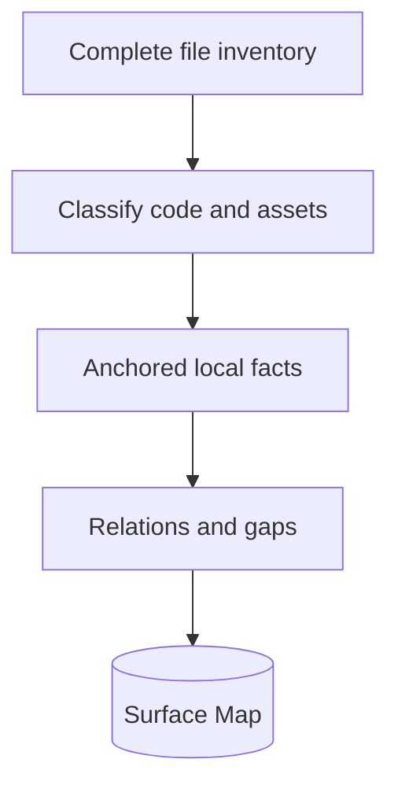
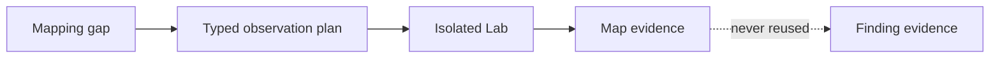

# Source mapping seam

Status: accepted design; Surface Map is optional exploration support

## Owner and purpose

`Source Mapping`は固定`Target Snapshot`から、根拠の強さと未解決部分を失わないversioned `Surface Map`を作る。これは検索の補助、coverageの可視化、発見済みpatternの横展開に使う地図であり、探索範囲または安全性の証明ではない。

```ts
interface SourceMapping {
  build(input: SurfaceMappingInput): Promise<SurfaceMapRef>;
}
```

parser、AI Mapper、runtime observation、revision mergeはこのInterfaceの背後へ隠す。callerはfile traversal、prompt chunk、provider session、Lab handleを扱わない。

## Position in discovery



Map nodeがないpathもFinderは読める。MapやSemgrepのnon-matchをcandidate rejectionまたはclosureへ使わない。最初のDepth Waveはraw sourceから独立に始める。

## Evidence-graded construction



Deterministic skeletonはinventory、digest、構文上のfact、source anchor、stable identityを固定する。AI Mapperは完成地図ではなく追加claimだけを提案する。Source Mappingがpath、digest、range、premise、predecessor bindingを検査し、受理・棄却理由をreceiptへ残す。

## Evidence states



- `observed`: 固定sourceまたはpolicy適合の観測に直接anchoredする。
- `inferred`: premiseと由来を持つが、直接観測と混同しない。
- `unknown`: 候補、必要証拠、gap reasonを持つ。

AIは既存`observed`を削除または昇格できない。矛盾は上書きせずConflictとして残す。

## Source and asset coverage



PHP、JavaScript、template、SQL、configuration、translation、bundled vendor、generated、minified、binary、unsupportedを黙って除外しない。解析しないassetもdigest、分類、reasonをgapへ残す。vendorであることだけを理由に到達可能なcodeを除外しない。

## Runtime observation boundary

Runtime observationはdynamic registration等のmapping gapを決定するためだけに、sealed baselineのfresh cloneとtyped planで行う。



任意payload、権限境界の突破、外部egress、unbounded requestを許可しない。timeoutまたはLab failureはrelation不存在ではなく`unknown`になる。観測結果をVerificationのWitnessやCausal Controlへ再利用しない。

## Revision and failure semantics

同じSnapshot、profile、accepted evidenceは同じrevisionへ収束する。旧revisionは書き換えず、新Snapshotへ過去のmodel inferenceを無検査で移植しない。

- identity、digest、schema、predecessor不一致: buildを拒否する
- parse diagnostic、unsupported asset: gap付きrevisionを返す
- AI failure、context ceiling: deterministic skeletonを保持して`mapping-incomplete`にする
- observation failure: reason付き`unknown`にする
- source anchor 0件: inventoryとgapは返せるが「解析成功」としない

## Invariants

1. Surface MapはFinding、priority、worker allocationを決めない。
2. source本文とcredential literalをMap artifactへ複製しない。
3. model proposalはclaim単位で検査し、黙って修復しない。
4. arrival orderに依存せずstable identityを作る。
5. incomplete Mapでもraw-source Explorationを妨げない。
6. Inventory、Mapping、Exploration、Verificationのcoverageを一つの割合へ潰さない。

## Behavior test surface

Testは`build(input)`と返されたimmutable viewを観測し、parser visitor、prompt数、model call count、merge helperを固定しない。

最低限、決定性、dynamic callbackの`unknown`保持、非PHP assetのgap、invalid AI claimの部分棄却、observed factの不変性、revision lineage、runtime evidenceのVerification流用拒否を保護する。

全体図は[攻撃面マップ構成](architecture/surface-map-architecture.md)、根拠は[security reference](../research/white-box-surface-mapping-security-reference.md)を参照する。現在のgeneratorや実装pathは[Codebase Guide](../CODEBASE-GUIDE.md)、対象別の数値は[実験記録](../experiments/README.md)だけに置く。
