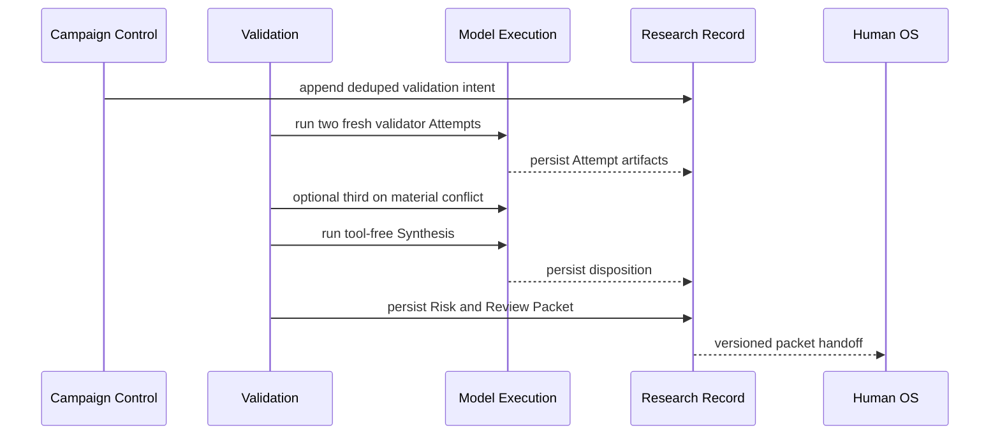

# Validation seam

Status: accepted, 2026-09-05

## Owner and purpose

Researchの`Validation` Moduleが所有する。ExplorationがRoot Evaluationまで終えたsource-bound candidateを、Finder transcriptまたはruntime executionに依存せず複数のfresh source reviewで反証し、Human OSへ渡せるcandidateと具体的なnegativeまたはproof gapへ分ける。

ValidationはFindingを作らず、Human Verificationを代行しない。validator fan-out、material conflictの判定、tool-free Synthesis、Risk Assessment、Human Review Packet生成を一つの深いInterfaceの背後へ隠す。

## Interface

```ts
interface Validation {
  validate(plan: ValidationPlan): Promise<ValidationRecordRef>;
}
```

`ValidationPlan`はCampaign、Target Snapshot、TargetFileManifest、Root-evaluated Validation Candidate、Validation Threat Context、Validation Policy、ValidatorとSynthesisのModel Profile、Source Tool Policy、残budgetをdigest-bindする。Lab Baseline、Experiment registry、Finder transcript、known advisory、CVE、patch、programme eligibilityを含めない。

callerはValidator数、Attempt順、第三Attemptの起動、Synthesisの入力構築を操作しない。`validate(plan)`の同じidentityは完了済みrecordへ収束し、partial Attemptをterminal dispositionとして返さない。

## Candidate intake and exact deduplication

Validation CandidateはWave BarrierとRoot Evaluationがdurableになった後だけ受理する。途中checkpointはcandidate材料として保持するが、単独でValidationを開始しない。Root Evaluation failureまたは未処遇subjectがあればcandidateを黙示的に捨てずResearchをIncompleteにする。

exact duplicate identityはTarget Snapshot、Manifest、attacker premise、broken security property、ordered causal route、source anchorから決定的に作る。表現、severity、Finder identity、支持数、到着順をidentityに使わない。exactでないsemantic similarityは自動collapseせず、Human Review Packetのmechanism groupingで保持する。

## Validation Threat Context

各Planは次をversion固定する。

- WordPressのtechnical threat baseline
- Permitted Attackerとcandidate固有のattacker premise
- Target Snapshotと公開plugin metadata
- Reconで観測したpublic surfaceと機能
- claimed broken security property
- 明示的なtechnical exclusion

programme eligibility、install数、報奨条件、known duplicateは別contextで扱う。Threat Contextに単に書かれていないことをRejectedの根拠にせず、明示的なtechnical exclusionがなくsource evidenceも不足する場合は`needs-research`とする。

## Independent attempts

通常は同じrubricとcandidateから二つのfresh Independent Validation Attemptを開始する。各Attemptは同じTarget Snapshot全体へManifest-boundな`list / search / read`でpivotできるが、Finder transcript、別Validatorのoutput、writable source、shell、build、test、WordPress runtimeを持たない。Candidate routeとanchorは開始点でありsource scopeではない。

各Attemptは次のcriterionを`pass / fail / unknown`とsource evidence refsで処遇する。

1. source integrity
2. reachability and attacker premise
3. broken control
4. causal route and security effect
5. counterevidence and proof gap

criterionまたはterminal proposalにmaterial conflictがある時だけ第三Attemptを開始する。material conflictは`ready-for-human / disproven / rejected`の提案差、reachability、control、precondition、effectの事実差、同じhopをprovedとmissingに分ける差を指す。severity、wording、risk labelだけの差は含めない。

Attemptがunrelatedな別vulnerabilityを発見した場合は新しいcheckpoint candidateとして記録し、元candidateのrubricへ混ぜない。各Attemptのquery、turn、source byte、cost、wall timeはFinderより低いversioned budgetを使う。

## Tool-free Synthesis

二つ、またはmaterial conflict時の三つのvalid Attemptがdurableになった後、fresh Validation Synthesisを一度だけ起動する。Synthesisはsource tool、Target source、Finder transcriptを持たず、Attemptが参照したevidenceとrubric resultだけを読む。新しいevidence、anchor、route、criterion resultを書き足したり書き換えたりできない。

支持数または多数決を判定根拠にしない。根拠refのない主張は採否に使わない。三Attempt後もmaterial conflictが閉じなければ`needs-research`にする。

## Dispositions

```text
ready-for-human | needs-research | disproven | rejected | validation-pending
```

- `ready-for-human`: 全criterionがpassし、残るunknownがruntime reproductionだけである。
- `needs-research`: sourceで決定可能な具体的proof gapがある。required fact、現source evidence、falsifier、次actionを必須にする。
- `disproven`: exact route、premise、controlまたはeffectを否定する決定的counterevidenceがある。
- `rejected`: source上の挙動は実在するがbroken security propertyまたはtechnical threat scopeに該当しない。
- `validation-pending`: valid Attempt不足、provider、budget、integrityまたはtool capabilityによりterminal Synthesisを作れない。

budget exhaustion、invalid output、provider failure、tool denialをDisprovedまたはRejectedにしない。Synthesisはseverityを理由にValidityを変更しない。

## Needs-research feedback

`needs-research`のproof gapは元のApproach FamilyへFrontier Gapとして返す。新しいFamilyを自動生成せず、元Familyの最大三Wave envelopeとCampaign全体のWave ceilingを消費する。曖昧な`research more`を受理しない。Family上限へ達したgapは`validation-pending`として残し、Human Review Packetを生成しない。

## Risk Assessment and Human Review Packet

`ready-for-human`のValidityがdurableになった後だけRisk Assessmentを作る。attacker role、prerequisite、exposed surface、security effect、configuration、blast radiusを構造化し、必要なら決定的calculatorでCVSSを投影する。RiskはValidation Dispositionを変更しない。

Human Review Packetは次をversioned handoff contractへ固定する。

- Target/version/snapshotとManifest digest
- deduped HypothesisとCausal Identity
- attacker premise
- inputからentrypoint、control、stateまたはsink、effectまでのroute
- source anchorと短いevidence
- 調べたcontrolとcounterevidence
- 各Validation Attempt、Synthesis、remaining runtime uncertainty
- Risk Assessmentとprecondition
- human reproduction sketch
- Human Verification Assistantのavailability
- packet artifact digest

raw transcript、credential、長い未検証payload、内部推論を含めない。Human OSはPacketに含まれないResearch Ledger、CAS、model sessionを直接読まない。

## Durable ordering and replay



intent、各Attempt、conflict decision、Synthesis、Risk Assessment、Packetの順でCASとLedgerへdurableにしてから次stageを開始する。crash後は完了済みartifactをdigestで再利用できるが、未完Attemptのconversationまたはpartial outputを別Attemptへ渡さない。

旧Verification/Finding schemaはread-only replayする。旧recordを新DispositionまたはReview Packetへ自動変換せず、旧Campaignと新Campaignのmetricを混ぜない。

## Invariants

1. ValidationはWave BarrierとRoot Evaluationの前に開始しない。
2. 通常二Attempt、material conflict時だけ三Attempt目を使う。
3. Validatorはread-only source toolだけを持ち、Synthesisはtoolを持たない。
4. support count、confidence、severityをValidity gateにしない。
5. source evidence refのない主張をSynthesis根拠にしない。
6. `needs-research`は同じApproach Familyの具体的Frontier Gapへだけ戻す。
7. budgetまたはprovider failureをfalse positiveへ丸めない。
8. Validation、Risk Assessment、Human Review PacketはFindingではない。
9. Research terminalをHuman DeferredまたはHuman Verification完了へ従属させない。
10. 旧Ledgerを新policyの意味へ再解釈しない。

## Behavior test surface

Testは`validate(plan)`とversioned Research read modelだけを観測し、private helper、prompt wording、SQL row、内部call順を固定しない。

最低限、Root Evaluation前の拒否、exact duplicate収束、二つのfresh Attempt、material conflictだけの第三Attempt、wording差で第三Attemptを起動しないこと、tool-free Synthesis、全rubric処遇、evidence ref integrity、各Disposition、needs-researchの同一Family feedback、三Wave ceiling、budget exhaustionのvalidation-pending、ValidityとRiskの分離、Packetの必須fieldとsecret/transcript除外、close/reopen replay、旧Ledger互換を保護する。

設計判断は[ADR 0122](../adr/0122-separate-source-validation-from-human-verification.md)、context間handoffは[Human Verification seam](human-verification-seam.md)、現在の実装状態は[Codebase Guide](../CODEBASE-GUIDE.md)を正本とする。
