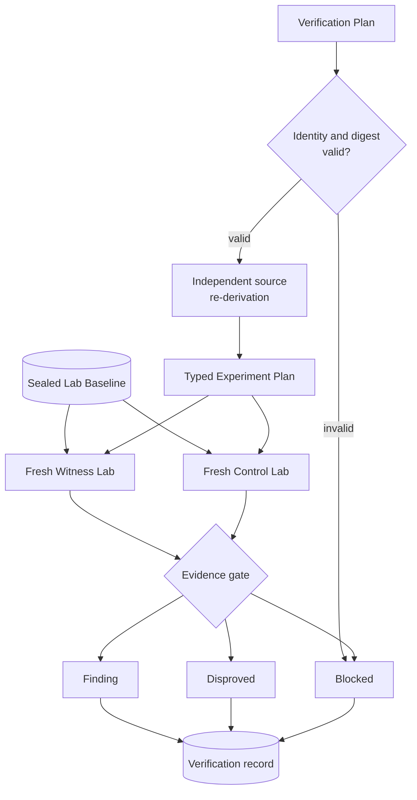
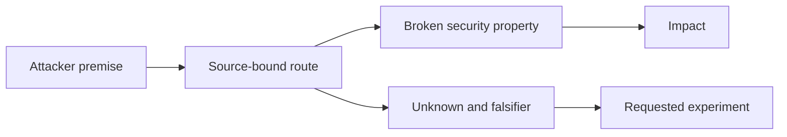
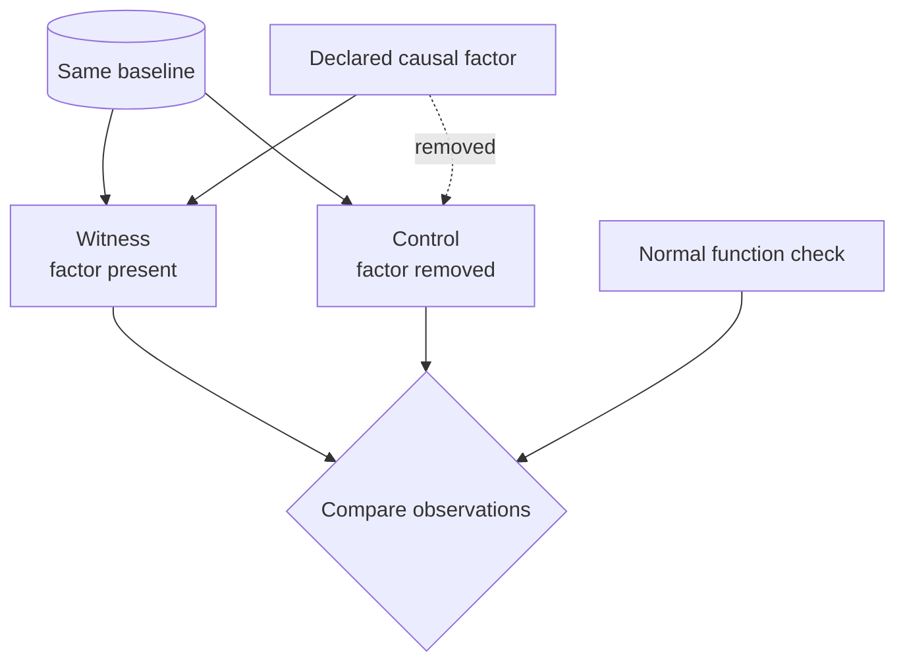
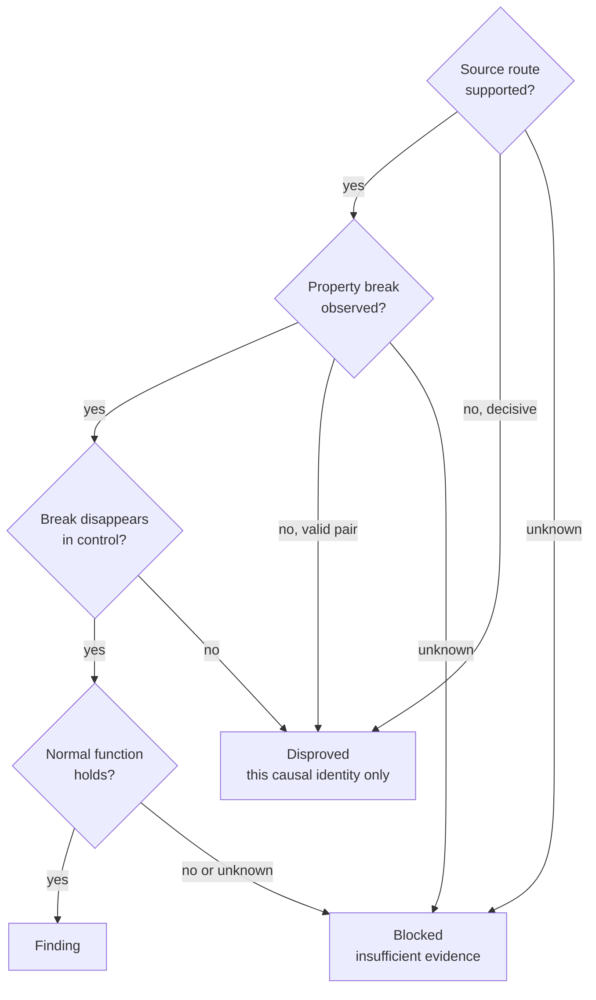
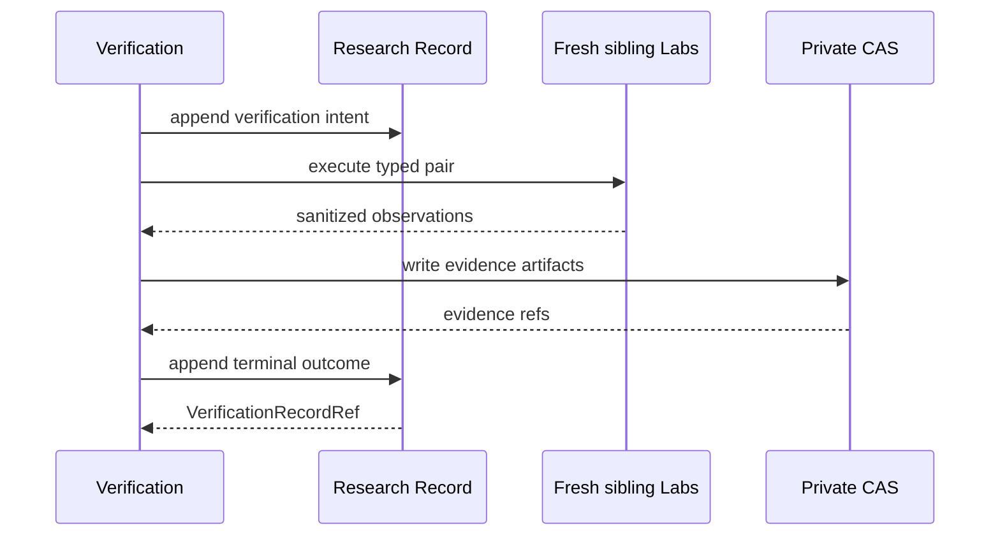

# Verification seam

Status: accepted design; current mechanisms are tracked only in the [Codebase Guide](../CODEBASE-GUIDE.md)

## Owner and purpose

`Verification`はsource-bound Hypothesisを固定Targetに対して独立に再導出し、隔離実験と因果対照から型付きoutcomeを作る。Finderの主張をそのまま証拠にせず、Findingへ昇格できる唯一のgateを所有する。

```ts
interface Verification {
  verify(plan: VerificationPlanV1): Promise<VerificationRecordRef>;
}
```

`preflight`、`runWitness`、`runControl`、`promoteFinding`を個別公開しない。安全な順序、freshness、evidence durability、promotion ruleは`verify`の背後へ隠す。

## Verification lifecycle



FinderとVerifierはAttempt、session、conversation、scratch、payload、mutable Labを共有しない。同じmodel familyを使っても独立性の代用にはしない。

## Minimal handoff

Verificationが受け取るHypothesisは次の因果要素に限定する。



Case role、expected result、advisory、CVE、patch narrative、known payload、Finder confidence、Discovery transcriptをPlanへ含めない。

## Causal experiment

WitnessとControlは同じsealed baselineから作るfresh siblingであり、宣言した一つのcausal factorだけを変える。



Target、runtime、setup、configuration、adapter versionが一致しないpairは証拠にしない。mapping用Runtime ObservationをWitnessへ流用しない。normal functionが壊れただけのnegativeを脆弱性修正と扱わない。

## Outcome gate



`Disproved`は一つのHypothesisと`Causal Identity`に限定する。plugin全体や別routeに脆弱性がないという意味へ拡張しない。支持も反証もできない時は、unsupported experiment、provider、budget、Lab isolation、non-hermetic state等をtyped `Blocked`として残す。

## Lab boundary

```ts
interface LabControl {
  execute(plan: ExperimentPlanV1): Promise<ExperimentObservationRef>;
}
```

Lab Controlはruntime、database、browser、cleanupを隠すが、Finding判定を行わない。Planはregistryにあるversioned mechanismだけを使い、任意shell、任意PHP、自由なsetup argv、host実行を許可しない。隔離runtimeが利用不能ならplain DockerへfallbackせずBlockedにする。

credential、cookie、raw browser trace、target source、sensitive readbackをLedgerへ保存しない。実験canaryとprincipalはLab専用・使い捨てにする。

## Durable ordering and replay



同じPlanの完了済み再実行は同じrefを返す。crash後にterminal recordがなければ古いVerifier outputやLabを再利用せず、fresh Attemptとfresh siblingで再開する。schema、digest、Ledger corruptionは研究上のBlockedへ丸めずread rejectionにする。

## Invariants

1. Findingにはsource再導出、Witness、Causal Control、normal-function observation、integrityがすべて必要である。
2. Finderの自己評価、model confidence、支持model数を証拠にしない。
3. VerificationからMap、Hypothesis、Campaign policyを書き換えない。
4. evidence artifactをdurable writeした後だけterminal refを返す。
5. Labまたはprovider failureをDisprovedにしない。
6. private evidenceとcredentialをpublic read modelへ出さない。

## Behavior test surface

Testは`verify(plan)`と返されたResearch read modelだけを観測する。内部phase、helper count、SQL row、Lab command順を固定しない。

最低限、Finding全gate、同じCausal IdentityのDisproved、typed Blocked、no-fallback isolation、sibling一致、artifact digest、close/reopen replay、unsupported schema rejectionを保護する。新しい脆弱性mechanismは、この同じInterfaceに一つのtyped Experiment vertical sliceとして追加する。

実装済みmechanismとTest pathは[Codebase Guide](../CODEBASE-GUIDE.md)、公開CVEでの実測は[実験記録](../experiments/README.md)だけに置く。
