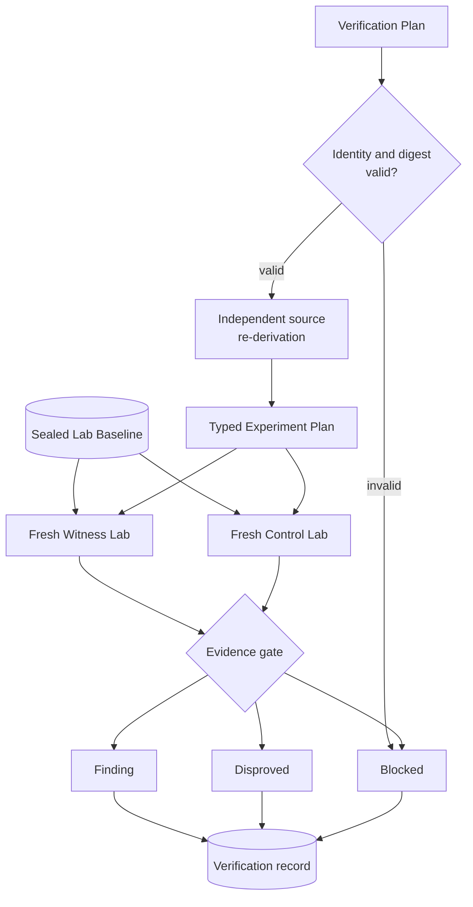
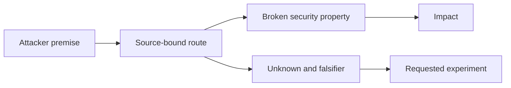
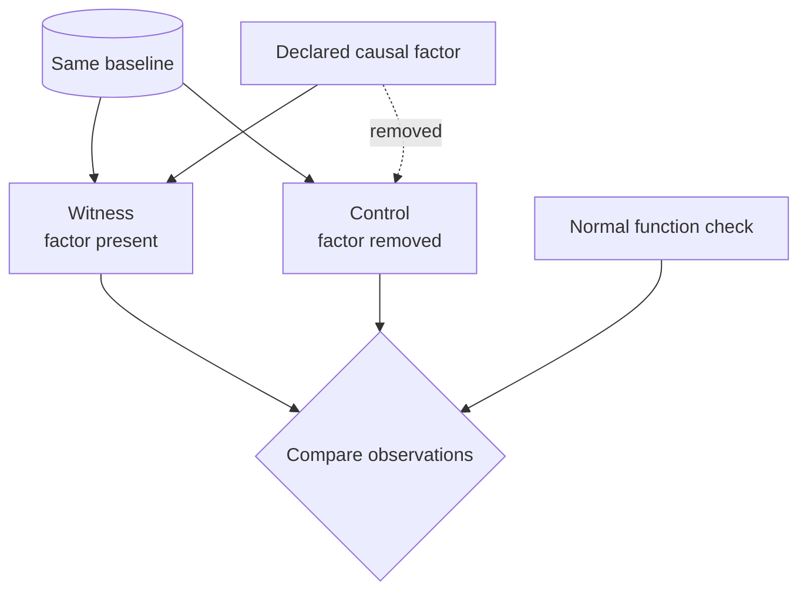
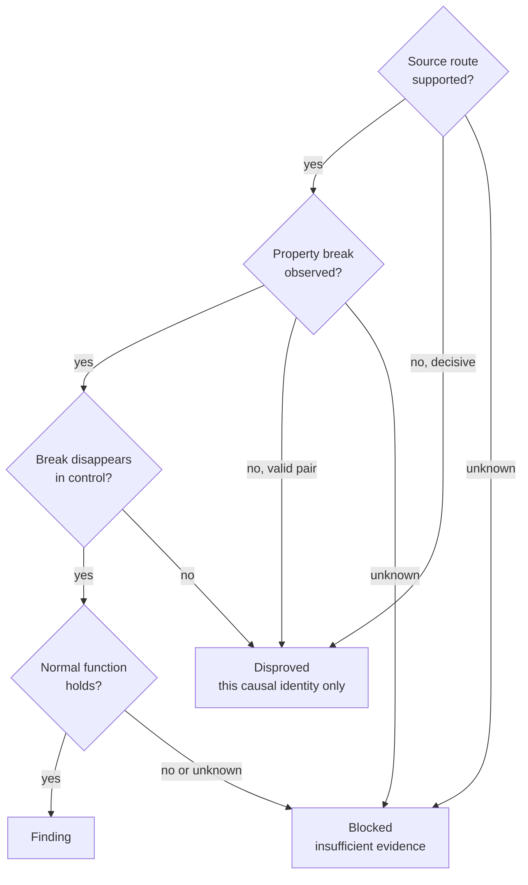
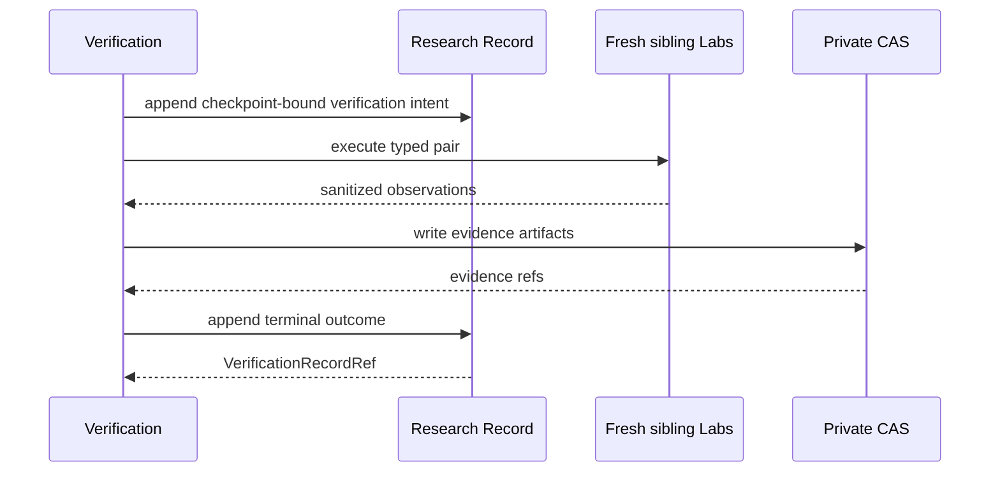

# Verification seam

Status: accepted design; current mechanisms are tracked only in the [Codebase Guide](../CODEBASE-GUIDE.md)

## Owner and purpose

`Verification`はsource-bound Hypothesisを固定Targetに対して独立に再導出し、隔離実験と因果対照から型付きoutcomeを作る。Finderの主張をそのまま証拠にせず、Findingへ昇格できる唯一のgateを所有する。

```ts
interface Verification {
  verify(plan: VerificationPlan): Promise<VerificationRecordRef>;
}
```

`preflight`、`runWitness`、`runControl`、`promoteFinding`を個別公開しない。安全な順序、freshness、evidence durability、promotion ruleは`verify`の背後へ隠す。

新規Verification Planは`Target Snapshot`と`TargetFileManifest` refを固定する。VerifierはHypothesisの全source anchorをManifestに対して再検査し、同じManifestへ拘束したread-only sourceから独立にrouteを再導出する。Surface Mapは必須入力にせず、Map nodeまたはMap inventoryをsource identityへ使わない。[ADR 0118](../adr/0118-bind-source-provenance-to-the-target-file-manifest.md)を正本とする。

## Verification lifecycle



FinderとVerifierはAttempt、session、conversation、scratch、payload、mutable Labを共有しない。同じmodel familyを使っても独立性の代用にはしない。

## Candidate intake

Finderがcheckpointした`Source-bound Hypothesis`は、Target / Manifest / Attempt / Work Lease binding、source anchor、schemaをHarnessが検査し、Verification intentをLedgerへdurableにした後、Wave BarrierまたはRoot Evaluationを待たずVerification Queueへ入る。Root Evaluationはこのintakeの前置gateではなく、Finder checkpointもFindingまたは真偽判定ではない。Verificationがfresh sourceから独立に再導出し、WitnessとCausal Controlまで通した時だけFindingへ昇格できる。

同じTarget、Manifest、attacker premise、broken security property、causal route、source anchorsを持つcandidateは一つのVerification identityへ収束させる。到着順、Finder数、model confidenceで優先度または真偽を変えない。Verifier枠が埋まっているcandidateはdurable queueへ残し、Root Evaluatorまたは別Attemptの失敗で削除しない。

## Verifier budget and usage

新規Campaignは`VerificationPlanV2`で、Verifierごとのwall time、model token、model turn、provider cost、structured output byteと、Campaign全体のVerification予約を固定する。Model Executionがprovider報告を共通usageへ正規化し、VerificationはそのusageをAttempt、Hypothesis、Planへbindしてterminal recordへ保存する。Campaign terminal usageはExplorationとVerificationをowner別に集計し、両者を混ぜた一つの推測値だけにしない。

必須usageが欠ける結果は`verifier-usage-incomplete`とする。hardに強制したwall time、provider cost、query、output上限を超えた結果は`budget-exhausted`としてWitness Lab開始前に停止する。完了recordはinput、cache creation、cache read、output token、turn、wall time、output byte、provider cost estimateをclose/reopen後も同じ値でreplayする。Campaign Controlは残りcost / wall-time / concurrency予約を次のVerification Planへ渡し、予約枠が尽きた後はcandidateをdurable queueに残して新しいVerifierを起動しない。

provider costはproviderが返すclient-side estimateであり、請求額の正本ではない。Claude transportではUSD ceilingを起動時に強制する。生成前のtoken停止を公開transportが提供せず、cache readを含む報告tokenはwork量と一対一対応しないためtelemetryとして扱う。生成後のtoken値だけでsource再導出を捨てないが、source再導出、Witness、Control、normal-function gateのいずれかが不完全ならFindingへ昇格しない。

## Minimal handoff

Verificationが受け取るHypothesisは次の因果要素に限定する。



Case role、expected result、advisory、CVE、patch narrative、known payload、Finder confidence、Discovery transcriptをPlanへ含めない。

## Causal experiment

WitnessとControlは同じsealed baselineから作るfresh siblingであり、宣言した一つのcausal factorだけを変える。



Target、runtime、setup、configuration、adapter versionが一致しないpairは証拠にしない。mapping用Runtime ObservationをWitnessへ流用しない。normal functionが壊れただけのnegativeを脆弱性修正と扱わない。

脆弱性categoryはVerifier routingに使えるが、固定exploit procedureにはしない。Independent Verifierはsourceからattacker sequenceと除去可能なcausal factorを自由に再導出し、Harnessはversioned Adapterが機械検査できるterminal security effectだけを要求する。SQL injectionのeffectはdatabase readbackに限定せず、response differential、state mutation、timing differential、authentication effectを選べる。XSSはbrowser execution contextをterminal effectとし、Stored、Reflected、DOMというdelivery方法を必須の中間状態にしない。[ADR 0121](../adr/0121-bind-verification-to-observable-security-effects.md)を正本とする。

ExperimentはPlanだけでなく、Independent Verifierが作ったexact `SourceRederivation`とそのdigestへbindする。`experimentId`と`siblingGroupId`にもre-derivation digestを含めるため、別routeの再導出を同じ実験pairとして再利用できない。

## Outcome gate



`Disproved`は一つのHypothesisと`Causal Identity`に限定する。plugin全体や別routeに脆弱性がないという意味へ拡張しない。支持も反証もできない時は、unsupported experiment、provider、budget、Lab isolation、non-hermetic state等をtyped `Blocked`として残す。

Account Takeoverの探索手法を一つの固定procedureまたは方式別adapter表へ畳まない。共通するterminal security semanticsは、攻撃者contextが開始時に対象principalとして未認証で、fresh WitnessではVerifierが再導出したattacker sequenceの後に対象principalとして認証でき、同じbindingでcausal factorだけを除いたControlでは認証できないことである。password reset、session establishment、authentication bypass、identity/email mutation、external account linking等のcapabilityと途中状態はVerifierがsourceから自由に再導出する。

`authentication-state-transition@v1`は方式中立のevidence contractであり、開始時認証状態、attacker sequenceの実行、terminal target-account authentication canaryだけをLedgerへ残す。方式固有の手順と中間secretはTargetごとのsealed Lab strategyへ閉じ、worker、input、source-route protocol、Target / fixture manifestをdigest-bindしてgVisor内だけで実行する。Claude Independent Verifierは方式を事前限定せずcausal routeと除去可能なfactorを再導出する。strategyを安全に実行または対照化できないHypothesisは捨てずVerification Queueへ残し、`unsupported-experiment`とする。将来はsealed workerをallowlistされたHTTP / browser operationのtyped DSLへ置き換え、研究判断を狭めず実行境界をさらに検査可能にする。

## Post-verification mechanism grouping

複数Finderが同じ脆弱性を異なるCausal Identity文字列で提出しても、Finding recordは一件ずつ不変に保持する。`CampaignReader.inspect({ kind: "finding-mechanism-groups", runId })`は、Runが参照するterminal VerificationからFindingだけを読み、versionedな`Finding Mechanism Group` viewを決定的に投影する。BlockedとDisprovedはgroupへ入れない。

同じTarget Snapshot、同じsource file identity集合を持つ相互overlapしたSource Rederivation range、同じtyped Experiment、Lab binding、Witness / Causal Control effectが揃うFindingだけを同じgroupへ接続する。Causal Identity、causal factorのmodel生成文字列、Finder数、到着順、confidenceはidentityに使わない。source rangeが相互にoverlapしないroute、Experiment種別、binding、observed effectのいずれかが異なるFindingは別groupにする。

groupは全Verification refを`discoveries`としてstable orderで保持し、group idとview digestを構造証拠から生成する。同じLedgerとCASからの再読は同じgroup順とdigestへ戻る。必要なevidence artifactが欠ける、digestが異なる、またはVerification bindingと一致しない場合はsingletonへfallbackせずreadを拒否する。これは外部advisoryと照合する`Known Duplicate Disposition`でも、異なるRunをoracleで採点する`Calibration Fingerprint`でもない。

## Lab boundary

```ts
interface LabControl {
  execute(request: ExperimentExecutionRequestV1): Promise<ExperimentObservationRef>;
}
```

`ExperimentExecutionRequestV1`はtyped Experiment Plan、supportedな`SourceRederivation`、そのdigestを一つに閉じる。固定手順を持つLab definitionは、実行できるadapterとrequired source evidenceをversioned source-route protocolとして宣言し、そのprotocol digestをsealed configurationへ含める。再導出のpath、file digest、line rangeがprotocolを満たさなければ、gVisor preflightやworkerを起動する前に`unsupported-experiment`でBlockedにする。

Lab Controlはruntime、database、browser、cleanupを隠すが、Finding判定を行わない。Requestはregistryにあるversioned mechanismだけを使い、任意shell、任意PHP、自由なsetup argv、host実行を許可しない。隔離runtimeが利用不能ならplain DockerへfallbackせずBlockedにする。一つのfresh gVisor LabがObservation作成前に失敗した場合は、そのLabをcleanupしてpartial evidenceを捨て、別nonceのfresh gVisor Labで一度だけ再試行する。二回目も失敗すれば`experiment-failed`とし、同じLab、runc、plain Dockerへfallbackしない。

credential、cookie、raw browser trace、target source、sensitive readbackをLedgerへ保存しない。実験canaryとprincipalはLab専用・使い捨てにする。

## Durable ordering and replay



同じPlanの完了済み再実行は同じrefを返す。crash後にterminal recordがなければ古いVerifier outputやLabを再利用せず、fresh Attemptとfresh siblingで再開する。Manifest artifactが利用不能ならVerifierまたはLabを起動せずtyped failureとして停止する。source anchor導入前に記録されたnode-route形式の`VerificationPlanV1`はLedger decode専用schemaで完全性を検査してreplayするが、新規Planとしては受理しない。schema、digest、Target binding、Ledger corruptionは研究上の脆弱性不存在へ丸めずread rejectionにする。

## Invariants

1. Findingにはsource再導出、Witness、Causal Control、normal-function observation、integrityがすべて必要である。
2. Finderの自己評価、model confidence、支持model数を証拠にしない。
3. VerificationからMap、Hypothesis、Campaign policyを書き換えない。
4. evidence artifactをdurable writeした後だけterminal refを返す。
5. Labまたはprovider failureをDisprovedにしない。
6. private evidenceとcredentialをpublic read modelへ出さない。
7. Verifier usageが欠落するかhard-enforced Plan上限を超えたrunからLabを開始せずFindingへ昇格しない。
8. WaveまたはRoot Evaluationのterminalをcandidate intakeの開始条件にしない。

## Behavior test surface

Testは`verify(plan)`と返されたResearch read modelだけを観測する。内部phase、helper count、SQL row、Lab command順を固定しない。

最低限、Finding全gate、同じCausal IdentityのDisproved、typed Blocked、checkpointからのWave中intake、duplicate candidateの一つのVerification identityへの収束、Root Evaluation failure後のqueue保持、Manifest-boundなsource再導出、MapなしVerification、Manifest外anchor拒否、source-route protocol不一致時の実行前拒否、Verifier usage欠落・hard budget超過時のLab実行前拒否、owner別usage集計、no-fallback isolation、失敗したfresh Labを破棄した一回限りの別namespace再試行、sibling一致、artifact digest、close/reopen replay、Finding Mechanism Groupの重複統合・別route分離・Blocked除外・決定的再読、unsupported schema rejectionを保護する。新しい脆弱性mechanismは、この同じInterfaceに一つのtyped Experiment vertical sliceとして追加する。

実装済みmechanismとTest pathは[Codebase Guide](../CODEBASE-GUIDE.md)、公開CVEでの実測は[実験記録](../experiments/README.md)だけに置く。
