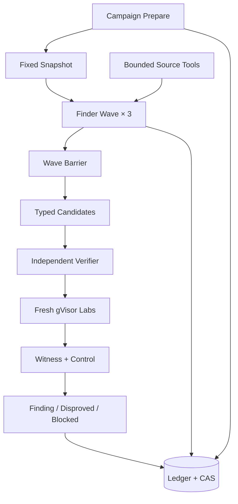
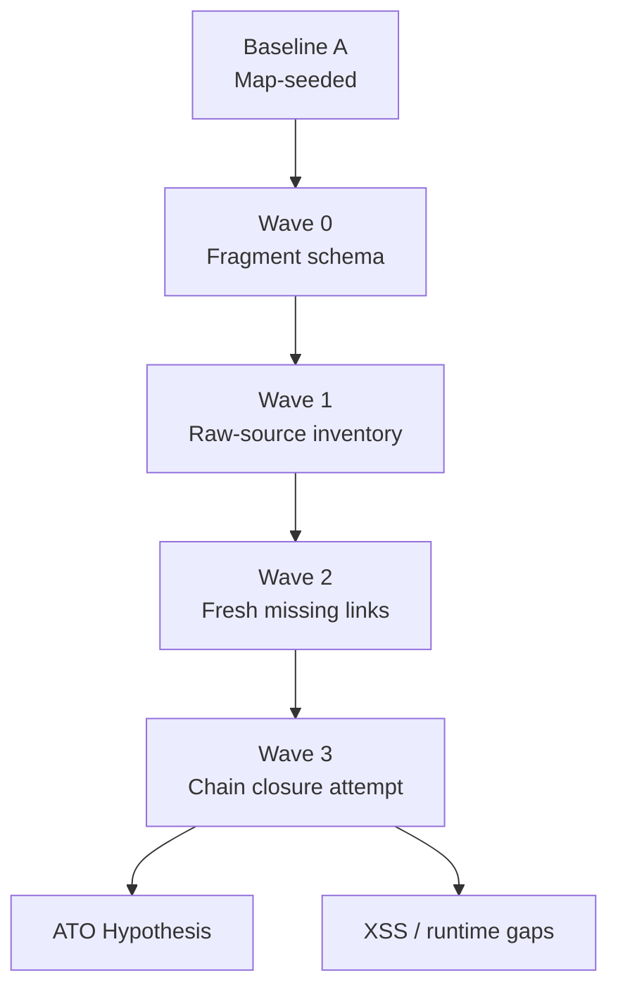

# Knowledge: 2026-09-02 Public-CVE E2E Campaign

Status: sanitized public-CVE experiment record, 2026-09-03

この文書の目的は脆弱性解説ではなく、現在のharnessがどの順序で動き、どのgateまで自動で到達したかを確認することである。時刻はResearch Ledgerまたはprivate CASのartifact時刻をUTCで集計した。Target source、payload、raw transcript、Witness本文はGitへ置かない。

## 1. 共通するE2E経路

BrizyとSSAは公開`CampaignRunner.run`を通り、Ledger、独立Verifier、gVisor実験まで接続した。TranslatePressの複数WaveはproductionのFinder materializer、Claude process、Source Evidence Gateway、typed output、CASを再利用したが、Wave間SynthesisはGit外の開発runnerで組み立てた。この差を「同じE2E成功」とは扱わない。

## 2. 結果の要約

| Case | 公開CVE | Target | Finder | Wall time | 到達点 |
| --- | --- | --- | --- | --- | --- |
| Brizy Stored XSS | [CVE-2026-5324](https://www.cve.org/CVERecord?id=CVE-2026-5324) | 2.8.11 | Opus 5 high × 3 | 7分14秒 | Stored XSSをFindingへ昇格。2.8.12の別検証で同じ原因をDisproved |
| SSA `fields` SQLi | [CVE-2026-3658](https://www.cve.org/CVERecord?id=CVE-2026-3658) | 1.6.9.29 | Opus 5 high × 3 | 12分21秒 | SQLi mechanismをFindingへ昇格。完全なunauthenticated premiseは未確定 |
| TranslatePress複合探索 | [CVE-2026-19632](https://www.cve.org/CVERecord?id=CVE-2026-19632)ほか | 3.2.5 | Opus 5 high × 3 / Wave | 5 run合計34分23秒 | ATOの主要chainをsource-bound Hypothesisとして再構成。runtime Verification未実施 |

## 3. Brizy 2.8.11 — Stored XSS

公開情報との照合先は[Wordfence advisory](https://www.wordfence.com/threat-intel/vulnerabilities/wordpress-plugins/brizy/brizy-page-builder-2811-unauthenticated-stored-cross-site-scripting-via-fileupload-field-value)である。Finderへadvisory、CVE、known file、parameter、payload、patch説明は渡していない。

### 運行trace

| UTC | Harness event | 観測内容 |
| --- | --- | --- |
| 14:06:55 | `campaign.prepared` | Target Snapshot、budget、Prompt Set、Model Profile、gVisor Runtime Profileをdigest固定 |
| 14:06:56 | 3 `campaign.attempt-started` | 同一Snapshotに対する3 Finderを約0.45秒以内に起動 |
| 14:09:38–14:10:37 | 3 `campaign.attempt-completed` | 3件のsource-bound Hypothesisを返却 |
| 14:10:37 | Wave barrier | Stored XSS、file-write、別authorization候補を型付き成果物として取込 |
| 14:10:37 | Verification 1 | file-write候補は対応Experimentがなく`unsupported-experiment`でBlocked |
| 14:10:37–14:14:09 | Verification 2 | fresh source re-derivation後、sibling gVisor labでWitnessとControlを実行 |
| 14:14:09 | `campaign.run-completed` | Stored XSSだけをFindingへ昇格し、Boundary Pair evidenceにより停止 |

Stored XSS Finderは、匿名form submissionの値が保存され、`html_entity_decode`後にadminの`href`属性へ未escapeで出力されるrouteを提示した。Independent VerifierはDiscoveryの結論をそのまま受理せずsourceを再導出し、freshなWitness/Control pairを要求した。

2.8.12のoracle-free Campaignは3 Finderを約2分35秒で完了したが、対象Findingへ昇格する候補を作らず`blocked-capability`で終了した。別の同一Causal Identityに拘束した検証では2.8.12を`security-property-preserved`としてDisprovedにした。positiveだけのhappy pathではなく、patched negativeと正常controlまで通した点がこのCaseの強い成果である。

## 4. Simply Schedule Appointments 1.6.9.29 — `fields` SQLi

公開情報との照合先は[Wordfence advisory](https://www.wordfence.com/threat-intel/vulnerabilities/wordpress-plugins/simply-schedule-appointments/appointment-booking-calendar-16100-unauthenticated-sql-injection-via-fields-parameter)である。

### 運行trace

| UTC | Harness event | 観測内容 |
| --- | --- | --- |
| 13:48:41 | prepare / run start | 749 files、2,750 Map nodes、271 relations、573 gapsを持つSnapshotを固定 |
| 13:48:41–13:48:42 | 3 Finder start | database、server、browser側の異なるMap seedから3並列起動 |
| 13:51:43–13:52:26 | Finder complete | `fields` SQLiが2件、CSS-context候補が1件 |
| 13:52:26 | Verification 1 | CSS候補はExperiment未対応でBlocked |
| 13:52:26–14:00:34 | Verification 2 | `fields`配列がSELECT-listへ未escapeで入るrouteを再導出し、database Witness/ControlでFinding |
| 14:00:34–14:01:02 | Verification 3 | public nonceを前提とする別の完全unauthenticated routeは証拠不足でBlocked |
| 14:01:02 | run complete | Finding 1件を残し、calibration待ちで終了 |

ここで実証できたのは、REST由来`fields`配列がquery helperのSELECT-listへ入り、SQL query integrityを破るmechanismである。ただしFindingへ昇格したHypothesisのattacker premiseはcustomer tokenを持つ利用者で、公開CVEが主張する完全なunauthenticated reachabilityを閉じた別Hypothesisは`evidence-incomplete`だった。したがって、このrunはCVE-2026-3658のroot mechanism再発見には成功したが、公開CVE全体のE2E再発見はpartialである。

mechanism変更後として取得した1.6.10.0のoracle-free runではFinding 0件だったが、保存済みDisproved recordは別のSQL candidateを反証したもので、positiveの`fields` Causal Identityと同一ではない。現時点ではこのCaseを完全なBoundary Pairと呼ばず、同一Identityのpatched verificationをやり直す必要がある。

## 5. TranslatePress 3.2.5 — 複数Wave探索

比較対象は、Account Takeoverの[CVE-2026-19632](https://www.wordfence.com/blog/2026/08/400000-wordpress-sites-affected-by-account-takeover-vulnerability-in-translatepress-wordpress-plugin/)、Stored XSSの[CVE-2026-75981](https://www.cve.org/CVERecord?id=CVE-2026-75981)、[CVE-2026-18510](https://www.cve.org/CVERecord?id=CVE-2026-18510)、[CVE-2026-76053](https://www.cve.org/CVERecord?id=CVE-2026-76053)である。これらはrun終了後の比較にだけ使った。

### Waveごとの変化

| Run | UTC / time | Source tool receipts | Typed output | 得られたこと |
| --- | --- | --- | --- | --- |
| Baseline A | 13:44:38–13:48:30 / 3分52秒 | Read 12、Search 15 | Hypothesis 3 | Map seed周辺のauthorization等へ収束し、公開比較Caseには一致しなかった |
| Wave 0 | 14:18:48–14:22:44 / 3分56秒 | Read 15、Search 17 | Hypothesis 1、Fragment 3 | Fragmentを捨てずに保存できたが、Map中心の局所探索から抜けられなかった |
| Wave 1 | 14:31:20–14:40:22 / 9分02秒 | List 3、Read 40、Search 39（denied/not-foundを含む） | Hypothesis 4、Fragment 11 | Target inventoryへ出て、公開nonce付きnopriv dictionary readと二つのXSS理論を発見。producerが不足 |
| Wave 2 | 14:41:22–14:49:01 / 7分39秒 | List 3、Read 49、Search 46 | Hypothesis 2、Fragment 11 | predecessorを未信頼入力としてfreshに再導出。`wp_mail_filter`からtranslation dictionaryへの保存、REST comment、translation-memory `v-html`を発見 |
| Wave 3 | 14:50:25–15:00:19 / 9分54秒 | List 4、Read 48、Search 39 | Hypothesis 4、Fragment 12 | outgoing email body保存と匿名row列挙を接続し、password-reset link disclosureからATOへ至る主要chainを構成 |

Tool数は3 Finder分のReceipt合計で、policy deny、budget exhaustion、not-foundも含む。denyを隠さず記録できた一方、List要求の一部がpath policyに拒否されており、Finder用tool ergonomicsには改善余地がある。

### 公開CVEとの比較結果

| 公開Case | この実験の到達点 | 判定 |
| --- | --- | --- |
| CVE-2026-19632 ATO | outgoing password-reset email → TranslatePress dictionary original → public nonce → nopriv ID enumeration → reset URL disclosure、という主要primitiveをsource上で接続 | 強いsource-bound rediscovery。ただしruntime WitnessなしでFindingではない |
| CVE-2026-75981 marker変換型Stored XSS | `#!trpst# / #!trpen#`変換mechanismを候補化できなかった | 未発見 |
| CVE-2026-18510 comment Stored XSS | REST/comment producerとdictionary/parser側の断片は得たが、同一routeとして閉じなかった | partial |
| CVE-2026-76053 noise-key/parser Stored XSS | HTML reserializer、attribute decode、comment境界を調べたが、公開noise-key constructionを完成しなかった | partial |
| 公開済みReflected XSS群 | 一致する完全routeなし | 未発見 |

この結果は、Surface Mapの改善だけでは解決しないことを示した。Raw-source inventoryを渡したWave 1で探索範囲が広がり、Wave 2/3のfresh missing-link追跡でATO chainへ到達した。一方、現在のmissing-link assignmentはprivate runnerが行っており、Root Planner、Approach Family Registry、Root Synthesis、Adversarial Criticはproduction codeへ未統合である。

## 6. E2Eとして確認できたこと・できなかったこと

確認できたこと:

- 同一Snapshotで3 Finderを実際に並列起動できる。
- provider outputをtyped Hypothesis/Fragmentへdecodeし、CASまたはLedgerへ残せる。
- Finderは最初のMap seed外をSearch/Read/Listで追跡できる。
- BrizyとSSAではDiscoveryからfresh Verifier、gVisor Witness/Controlまで自動接続できる。
- unsupported mechanismをFindingへ丸めずBlockedにできる。
- TranslatePressではWave間にpartial artifactを渡すことで、単発探索になかった複合ATO chainへ進める。

まだ確認できていないこと:

- production `CampaignRunner`が複数Waveを自律生成し、Criticとmissing-link追跡を繰り返すこと。
- ATO、Reflected XSS、RCEのtyped ExperimentとgVisor Verification。
- TranslatePress Stored XSSの既知mechanismを複数種類とも再発見するrecall。
- Claude以外のProvider Adapterで同じartifact contractを維持すること。
- prospectiveな未知Targetで高impact Findingを独立実証すること。
