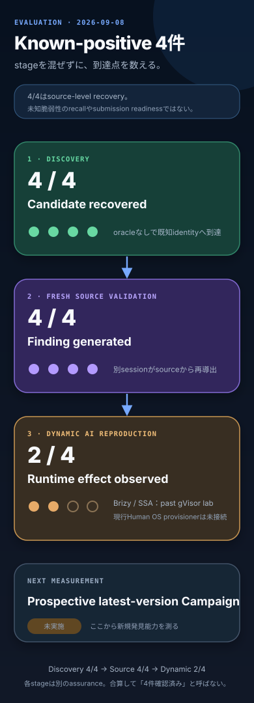

# Native Agent known-positive evaluation — 2026-09-08

## Result

wp2shell型Prompt、pinned WordPress source、provider-native Root / subagentを使った現在のResearch loopは、評価用known-positive 4件すべてでcandidateを回収し、fresh Independent Validationから`source-validated` Findingを生成した。これは4/4のsource-level recoveryであり、未知脆弱性のrecall、最新版での残存またはsubmission readinessを意味しない。

現行production Human OSにはWordPress / MySQL labのprovision / executionがまだ接続されていない。したがって2/4のruntime observationは診断coreの再発見結果を補強する過去実測であり、現在の`ResearchCampaigns`からDynamic AI ReproductionまでのE2E接続を示さない。

## Public cases

| Target | Public record | Source Validation | Dynamic observation |
| --- | --- | --- | --- |
| Brizy 2.8.11 Stored XSS | [CVE-2026-5324](https://www.cve.org/CVERecord?id=CVE-2026-5324) | passed | browser canary observed |
| Simply Schedule Appointments 1.6.9.29 SQLi | [CVE-2026-3658](https://www.cve.org/CVERecord?id=CVE-2026-3658) | passed | database readback canary observed |
| TranslatePress 3.3.1 ATO | [CVE-2026-19632](https://www.cve.org/CVERecord?id=CVE-2026-19632) | passed | not run |

残る一件は対応するpublic CVE recordを確認できていないため、[ADR 0115](../adr/0115-publish-only-public-cve-experiment-results.md)に従いTarget、version、mechanismをGitへ記録しない。探索中に得た既知identity以外のcandidateも、新規性、runtime effect、最新版での残存を確認するまでこの評価へ含めない。
